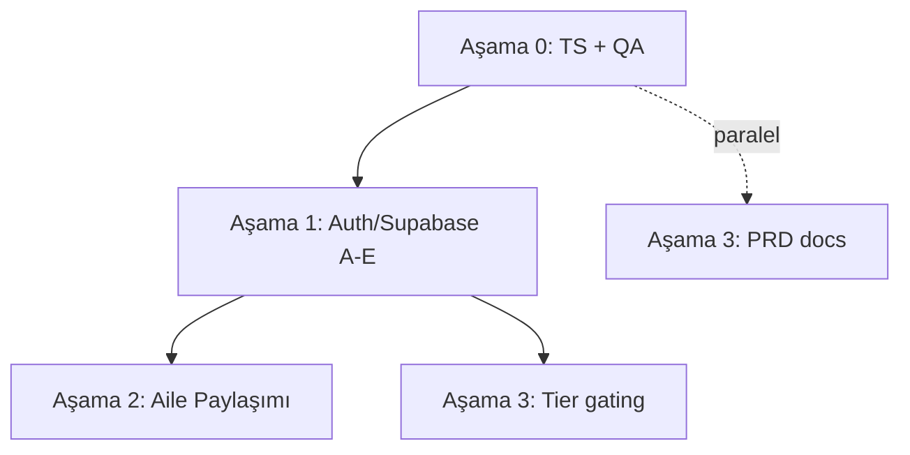

# İş Planı

**Oluşturulma:** 2026-06-22
**Kaynak:** `tasks/yapilacaklar.md` (devam eden + başlanmamış işler)

Bu dosya, `yapilacaklar.md`'deki açık işleri yürütme sırasına, bağımlılıklara ve tahminlere göre aşamalara böler. Mevcut durum kod tabanına bakılarak doğrulanmıştır.

---

## Mevcut durum (doğrulama)

**Son güncelleme:** 2026-06-22 — Aşama 1 büyük ölçüde tamamlandı (email auth + pet cloud sync).

| Alan | Durum |
|------|-------|
| TypeScript | `npx tsc --noEmit` → **temiz (0 hata)** |
| Auth | `app/(auth)/index.tsx` gerçek email/şifre UI; "Continue as Guest" kaldırıldı; Apple/Google kaldı |
| Bootstrap | `hooks/use-bootstrap.ts` auth guard aktif: `splash → onboarding → auth → setup → home` |
| User store | `signIn/signOut/session listener` + `currentUserId↔user.id`; Supabase client (`lib/supabase.ts`) |
| Sync | Pet'ler Supabase kaynak-doğruluk (write-through + pull); check-in/records hâlâ yerel |

> **Guest kararı:** Canlı kullanıcı var ancak mevcut local veri korunmak zorunda değil (kullanıcılar yeniden profil oluşturacak). → Auth geçişinde **guest→hesap migration gerekmez**; temiz wipe yeterli. (Hesap izolasyonu: farklı hesap girişinde yerel veri wipe; pet'ler buluttan geri gelir.)

---

## Bağımlılık akışı

**Yürütme sırası:** Aşama 0 (TS + QA paralel) → Aşama 1 (sıralı A→E) → Aşama 2 + Aşama 3 paralel.

---

## Aşama 0 — Temizlik & QA (devam eden)

Auth'a başlamadan kod tabanını yeşile çekmek. **Tahmini: ~0.5–1 gün.**

### 0.1 TypeScript hatalarını sıfırla (Öncelik 1)

Önerilen sıra (riskten bağımsıza):

- [x] **`hooks/use-color-scheme.ts` + `.web.ts`** — `return systemScheme ?? null`
- [x] **`services/notifications/schedule.ts`** — `reminderTime` null guard eklendi (null ise schedule atlanıyor)
- [x] **`app/(onboarding)/_layout.tsx` + `app/(setup)/_layout.tsx`** — `detachInactiveScreens` kaldırıldı (v54'te geçersiz prop; form state zaten `useSetupStore`'da)

**Sonuç:** `npx tsc --noEmit` temiz (exit 0), lint temiz. ✅

### 0.2 QA — kalan manuel testler (Öncelik 2, paralel)

- [ ] TR ↔ EN dil geçişi (tüm ekranlar)
- [ ] Daily Check-In Faz 5: dil geçişi, yeni kayıt + düzenleme, eski kayıt migration, VoiceOver / Reduce Motion
- [ ] Profile Tab matrisi T1–T12 + 2 pet ile delete akışı
- [ ] Multi-Pet matrisi T1–T10

**Çıktı:** `yapilacaklar.md` checkbox'ları işaretlenir; bulunan buglar ayrı maddeye düşülür.

---

## Aşama 1 — Auth / Supabase (devam ediyor — email + pet sync tamam)

Aile Paylaşımı, Tier gating ve Sync hepsi buna bağlı.

> Native auth kararı: Apple = `expo-apple-authentication`, Google = `@react-native-google-signin/google-signin`, ardından `supabase.auth.signInWithIdToken`. Native test için **development build** gerekir (Expo Go yetmez).

### Faz A — Supabase kurulum ✅
- [x] `@supabase/supabase-js` + `expo-secure-store` (+ apple-auth, google-signin, dev-client, aes-js, url-polyfill, get-random-values)
- [x] Env: `EXPO_PUBLIC_SUPABASE_URL`, `EXPO_PUBLIC_SUPABASE_ANON_KEY` (`.env` + `.env.example`)
- [x] `lib/supabase.ts` client (`LargeSecureStore` — AES'li SecureStore session adaptörü)
- [x] `app.json`: bundle id `com.luluapp.app`, `usesAppleSignIn`, plugin'ler; `eas.json` dev build profilleri
- [ ] Supabase provider'lar: **Email açık** ✅; **Apple/Google kapalı** (credential + dashboard ayarı kaldı)

### Faz B — Auth ekranı (zorunlu) ✅ (email)
- [x] `app/(auth)/index.tsx` gerçek email/şifre UI (giriş ↔ kayıt, validasyon, i18n en/tr/de)
- [x] **"Continue as Guest" kaldırıldı**
- [x] `use-bootstrap.ts` auth guard: oturum yoksa → `(auth)`
- [x] Akış: `Splash → Onboarding → Auth → Setup (pet yoksa) → Home`
- ⏬ Apple / Google butonları → **yayın öncesi son adıma ertelendi** (bkz. "Yayın öncesi" bölümü)

### Faz C — User lifecycle 🟡
- [x] `user.store`: `signInWithEmail`, `signUpWithEmail`, `signOut`, session listener
- [x] `currentUserId` ↔ Supabase `user.id`
- [x] Pet → `user_id` (Supabase user ID; cloud `pets` tablosu)
- [x] Log Out → `(auth)`'a dön (LegalCard bağlandı)
- [x] Delete Account → Supabase user sil + local wipe (`delete_user` SECURITY DEFINER RPC, `0003_delete_user.sql`; cascade + avatar storage temizliği; ardından `signOut('local')` + `deleteAllLocalData`)

### Faz D — Free / Plus tier temeli ⬜
- [ ] `isPlusActive` (şimdilik Supabase metadata; RevenueCat sonra)
- [ ] Tier bazlı feature gating altyapısı (hook)

### Faz E — Sync 🟡 (pet + check-in + record tamam)
- [x] Supabase şeması: `pets` / `check_ins` / `pet_records` + RLS + `updated_at` trigger (`supabase/migrations/0001_init.sql`)
- [x] **Pets sync**: kaynak-doğruluk; write-through (create/update/delete) + giriş/açılışta pull; ilk açılışta yerel→bulut migrasyon
- [x] **Check-ins sync** (`services/sync/check-ins-sync.ts`): write-through + pull; yerel→bulut migrasyon
- [x] **Records sync** (`services/sync/records-sync.ts`): write-through + pull; yerel→bulut migrasyon
- [x] **Profil sync** (`services/sync/profile-sync.ts`): isim + avatar; avatar → Supabase Storage (`avatars` bucket), `profiles` tablosu (`0002_profiles.sql`)
- [x] Pull sırası: pets → check-ins → records → profile; hesap izolasyonu/pet silme yerel cascade temizliği
- [ ] Pet fotoğrafı → Supabase Storage (avatar altyapısı hazır; aynı `uploadAvatar` deseni kullanılacak)
- [ ] *(İleri faz)* Gerçek offline-first kuyruk + last-write-wins çakışma çözümü (şimdilik online write-through best-effort)

---

## Aşama 2 — Aile Paylaşımı (başlanmamış, Lulu Plus)

**Bağımlılık:** Aşama 1 (A–E). **Tahmini: ~3–4 gün.**

### Faz A — Domain modeli
- [ ] `types/sharing.ts`: `CaregiverRole`, `PetInvite`, `SharedPet`
- [ ] Supabase tabloları: `pet_shares`, `invites`
- [ ] İzin matrisi: owner / editor / viewer

### Faz B — Supabase RLS & API
- [ ] Row Level Security: role bazlı pet erişimi
- [ ] Davet akışı: email / deep link
- [ ] Çakışma: iki caregiver aynı gün check-in güncellerse?

### Faz C — UI
- [ ] Pet Profile / Settings → "Share with Family"
- [ ] `isPlusActive === false` → upgrade CTA (Lulu Plus)
- [ ] `isPlusActive === true` → davet gönder / caregiver listesi

### Faz D — Store
- [ ] Aktif pet listesi: kendi pet'lerim + paylaşılanlar
- [ ] Paylaşılan pet'lerde rol bazlı UI (viewer = read-only)

---

## Aşama 3 — Tier farkları & Dokümantasyon (başlanmamış, küçük)

**Bağımlılık:** Tier için Aşama 1-D; PRD bağımsız (paralel). **Tahmini: ~0.5–1 gün.**

- [ ] Free vs Plus rapor özellik farkları — şimdilik tümü açık veya basit gating
- [ ] PRD Screen 17 güncelle: Profile hub + Settings ayrımı (Screen 17a / 17b)
- [ ] commit `docs: update PRD for profile hub and settings split`

---

## Yayın öncesi son adım — Apple + Google native giriş

> **Karar:** Tüm uygulama özellikleri tamamlandıktan sonra, yayına çıkmadan hemen önce eklenecek. Email/şifre auth geliştirme boyunca yeterli; Apple/Google native test development build + credential gerektirdiği için en sona bırakıldı.

- [ ] Apple Developer + Google Cloud OAuth credential'ları
- [ ] Supabase dashboard: Apple + Google provider'ları aç
- [ ] `EXPO_PUBLIC_GOOGLE_WEB_CLIENT_ID` + `EXPO_PUBLIC_GOOGLE_IOS_CLIENT_ID`
- [ ] `app/(auth)/index.tsx`: Apple + Google butonları → `signInWithIdToken`
- [ ] EAS development build ile native test (Expo Go yetmez)

---

## Gelecek (kapsam dışı, bağlantı noktaları)

| Konu | Bağımlılık |
|------|------------|
| StoreKit / RevenueCat | Lulu Plus gerçek IAP |
| Cloud sync / cross-device active pet | Auth + Supabase |
| My Pets'ten tek pet silme UI | v1 dışı |
| Pet başına notification prefs | v1 dışı |
