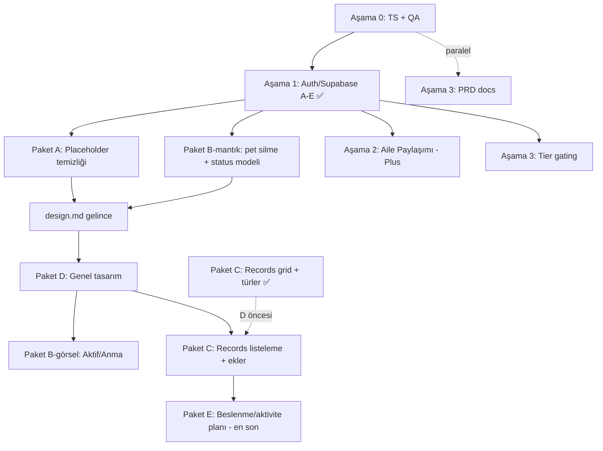

# İş Planı

**Oluşturulma:** 2026-06-22
**Kaynak:** `tasks/yapilacaklar.md` (devam eden + başlanmamış işler)

Bu dosya, `yapilacaklar.md`'deki açık işleri yürütme sırasına, bağımlılıklara ve tahminlere göre aşamalara böler. Mevcut durum kod tabanına bakılarak doğrulanmıştır.

---

## Mevcut durum (doğrulama)

**Son güncelleme:** 2026-06-22 — Paket C kısmen tamamlandı (Records grid + 8 kayıt türü + legacy migrasyon). Beş yeni iş paketi (A–E) sıraya yerleştirildi; C'nin grid/tür kısmı D'den önce referans görselle uygulandı.

| Alan | Durum |
|------|-------|
| TypeScript | `npx tsc --noEmit` → **temiz (0 hata)** |
| Auth | `app/(auth)/index.tsx` gerçek email/şifre UI; "Continue as Guest" kaldırıldı; Apple/Google kaldı |
| Bootstrap | `hooks/use-bootstrap.ts` auth guard aktif: `splash → onboarding → auth → setup → home` |
| User store | `signIn/signOut/session listener` + `currentUserId↔user.id`; Supabase client (`lib/supabase.ts`) |
| Sync | Pet/check-in/record/profil Supabase kaynak-doğruluk (write-through + pull) |

> **Guest kararı:** Canlı kullanıcı var ancak mevcut local veri korunmak zorunda değil (kullanıcılar yeniden profil oluşturacak). → Auth geçişinde **guest→hesap migration gerekmez**; temiz wipe yeterli. (Hesap izolasyonu: farklı hesap girişinde yerel veri wipe; pet'ler buluttan geri gelir.)

---

## Bağımlılık akışı

**Yürütme sırası (klasik):** Aşama 0 (TS + QA paralel) → Aşama 1 (✅) → Aşama 2 + Aşama 3 paralel.

## Yeni paketler — yürütme sırası

Kullanıcı kararları (2026-06-22): **quick wins önce**, **B-görsel + C listeleme `design.md`'yi bekleyebilir**, **E en sona**. Paket C grid/tür kısmı referans görselle D öncesi uygulandı.

| Sıra | İş | Tasarıma bağlı? | Not |
|------|-----|------|-----|
| 1 | **Paket A** — placeholder temizliği & kararlar | Hayır | Mantık/metin; hemen |
| 2 | **Paket B-mantık** — pet silme UI bağlama + `status` modeli + migration | Hayır | `deletePet` zaten var |
| 3 | **Paket D** — genel tasarım | `design.md` gerekli | Token + component + ekranlar |
| 4 | **Paket B-görsel** — Aktif/Anma bölümleri | Evet (D sonrası) | D ile aynı dil |
| 5 | **Paket C** — Records tasarım & listeleme | Kısmen (grid + türler ✅) | Grid/türler referans görselle yapıldı; listeleme + ekler bekliyor |
| 6 | **Paket E** — beslenme/aktivite planı | — | En sona; yaklaşım kararı bekliyor |

> Paralel hatlar (bağımsız): Auth **Faz D (tier)**, **Aile Paylaşımı (Aşama 2)**, **PRD docs (Aşama 3)** istenirse araya alınabilir. Tier (Faz D), hem Aile Paylaşımı hem de Paket E'nin Plus gating'i için ön koşul olabilir.

---

## Aşama 0 — Temizlik & QA (devam eden)

Auth'a başlamadan kod tabanını yeşile çekmek. **Tahmini: ~0.5–1 gün.**

### 0.1 TypeScript hatalarını sıfırla (Öncelik 1)

Önerilen sıra (riskten bağımsıza):

- [x] **`hooks/use-color-scheme.ts` + `.web.ts`** — `return systemScheme ?? null`
- [x] **`services/notifications/schedule.ts`** — `reminderTime` null guard eklendi (null ise schedule atlanıyor)
- [x] **`app/(onboarding)/_layout.tsx` + `app/(setup)/_layout.tsx`** — `detachInactiveScreens` kaldırıldı (v54'te geçersiz prop; form state zaten `useSetupStore`'da)

**Sonuç:** `npx tsc --noEmit` temiz (exit 0), lint temiz. ✅

### 0.2 QA — kalan manuel testler (Öncelik 2, paralel)

- [ ] TR ↔ EN dil geçişi (tüm ekranlar)
- [ ] Daily Check-In Faz 5: dil geçişi, yeni kayıt + düzenleme, eski kayıt migration, VoiceOver / Reduce Motion
- [ ] Profile Tab matrisi T1–T12 + 2 pet ile delete akışı
- [ ] Multi-Pet matrisi T1–T10

**Çıktı:** `yapilacaklar.md` checkbox'ları işaretlenir; bulunan buglar ayrı maddeye düşülür.

---

## Aşama 1 — Auth / Supabase (devam ediyor — email + pet sync tamam)

Aile Paylaşımı, Tier gating ve Sync hepsi buna bağlı.

> Native auth kararı: Apple = `expo-apple-authentication`, Google = `@react-native-google-signin/google-signin`, ardından `supabase.auth.signInWithIdToken`. Native test için **development build** gerekir (Expo Go yetmez).

### Faz A — Supabase kurulum ✅
- [x] `@supabase/supabase-js` + `expo-secure-store` (+ apple-auth, google-signin, dev-client, aes-js, url-polyfill, get-random-values)
- [x] Env: `EXPO_PUBLIC_SUPABASE_URL`, `EXPO_PUBLIC_SUPABASE_ANON_KEY` (`.env` + `.env.example`)
- [x] `lib/supabase.ts` client (`LargeSecureStore` — AES'li SecureStore session adaptörü)
- [x] `app.json`: bundle id `com.luluapp.app`, `usesAppleSignIn`, plugin'ler; `eas.json` dev build profilleri
- [ ] Supabase provider'lar: **Email açık** ✅; **Apple/Google kapalı** (credential + dashboard ayarı kaldı)

### Faz B — Auth ekranı (zorunlu) ✅ (email)
- [x] `app/(auth)/index.tsx` gerçek email/şifre UI (giriş ↔ kayıt, validasyon, i18n en/tr/de)
- [x] **"Continue as Guest" kaldırıldı**
- [x] `use-bootstrap.ts` auth guard: oturum yoksa → `(auth)`
- [x] Akış: `Splash → Onboarding → Auth → Setup (pet yoksa) → Home`
- ⏬ Apple / Google butonları → **yayın öncesi son adıma ertelendi** (bkz. "Yayın öncesi" bölümü)

### Faz C — User lifecycle 🟡
- [x] `user.store`: `signInWithEmail`, `signUpWithEmail`, `signOut`, session listener
- [x] `currentUserId` ↔ Supabase `user.id`
- [x] Pet → `user_id` (Supabase user ID; cloud `pets` tablosu)
- [x] Log Out → `(auth)`'a dön (LegalCard bağlandı)
- [x] Delete Account → Supabase user sil + local wipe (`delete_user` SECURITY DEFINER RPC, `0003_delete_user.sql`; cascade + avatar storage temizliği; ardından `signOut('local')` + `deleteAllLocalData`)

### Faz D — Free / Plus tier temeli ⬜
- [ ] `isPlusActive` (şimdilik Supabase metadata; RevenueCat sonra)
- [ ] Tier bazlı feature gating altyapısı (hook)

### Faz E — Sync 🟡 (pet + check-in + record tamam)
- [x] Supabase şeması: `pets` / `check_ins` / `pet_records` + RLS + `updated_at` trigger (`supabase/migrations/0001_init.sql`)
- [x] **Pets sync**: kaynak-doğruluk; write-through (create/update/delete) + giriş/açılışta pull; ilk açılışta yerel→bulut migrasyon
- [x] **Check-ins sync** (`services/sync/check-ins-sync.ts`): write-through + pull; yerel→bulut migrasyon
- [x] **Records sync** (`services/sync/records-sync.ts`): write-through + pull; yerel→bulut migrasyon
- [x] **Profil sync** (`services/sync/profile-sync.ts`): isim + avatar; avatar → Supabase Storage (`avatars` bucket), `profiles` tablosu (`0002_profiles.sql`)
- [x] Pull sırası: pets → check-ins → records → profile; hesap izolasyonu/pet silme yerel cascade temizliği
- [x] Pet fotoğrafı → Supabase Storage (`pet-photos` bucket + RLS, `0004_pet_photos.sql`; `uploadPetPhoto`/`deletePetPhotoFiles`; edit-pet seçim anında yükler; pet/hesap silmede temizlik)
- [ ] *(İleri faz)* Gerçek offline-first kuyruk + last-write-wins çakışma çözümü (şimdilik online write-through best-effort)

---

## Aşama 2 — Aile Paylaşımı (başlanmamış, Lulu Plus)

**Bağımlılık:** Aşama 1 (A–E). **Tahmini: ~3–4 gün.**

### Faz A — Domain modeli
- [ ] `types/sharing.ts`: `CaregiverRole`, `PetInvite`, `SharedPet`
- [ ] Supabase tabloları: `pet_shares`, `invites`
- [ ] İzin matrisi: owner / editor / viewer

### Faz B — Supabase RLS & API
- [ ] Row Level Security: role bazlı pet erişimi
- [ ] Davet akışı: email / deep link
- [ ] Çakışma: iki caregiver aynı gün check-in güncellerse?

### Faz C — UI
- [ ] Pet Profile / Settings → "Share with Family"
- [ ] `isPlusActive === false` → upgrade CTA (Lulu Plus)
- [ ] `isPlusActive === true` → davet gönder / caregiver listesi

### Faz D — Store
- [ ] Aktif pet listesi: kendi pet'lerim + paylaşılanlar
- [ ] Paylaşılan pet'lerde rol bazlı UI (viewer = read-only)

---

## Aşama 3 — Tier farkları & Dokümantasyon (başlanmamış, küçük)

**Bağımlılık:** Tier için Aşama 1-D; PRD bağımsız (paralel). **Tahmini: ~0.5–1 gün.**

- [ ] Free vs Plus rapor özellik farkları — şimdilik tümü açık veya basit gating
- [ ] PRD Screen 17 güncelle: Profile hub + Settings ayrımı (Screen 17a / 17b)
- [ ] commit `docs: update PRD for profile hub and settings split`

---

## Paket A — Placeholder temizliği & kararlar (tasarımdan bağımsız, ilk) — 🟢 büyük ölçüde tamam

**Detay:** `yapilacaklar.md` → "Yeni iş paketleri → A".

- [x] A2: Community **Rate Lulu** — yanıltıcı "Çok Yakında" kaldırıldı; in-app prompt uygun değilse mağaza sayfası açılıyor (`APP_STORE_REVIEW_URL`)
- [x] A3: Records **Attachments** — placeholder + modal + component kaldırıldı; gerçek ek **Paket C**'ye taşındı
- [x] A4: `deletePet` UI'a bağlandı (Paket B1)
- [ ] A1: Lulu Plus coming-soon → IAP (Faz D / Gelecek) gelene kadar bilinçli kalır
- [x] `ComingSoonModal` kullanımları gözden geçirildi (kalan tek bilinçli kullanım: Lulu Plus)

## Paket B — Pet silme + status modeli — ✅ B1 + B2 tamam

**Not:** Görsel Aktif/Anma ayrımı şimdilik basit bölüm (`GroupedSection`) olarak yapıldı; Paket D (design.md) sonrası cilalanacak.

- [x] B1: **Edit Pet** ekranına "Delete Pet" (destructive Button + `ConfirmModal`) + i18n → `usePetStore.deletePet`
- [x] B1: Silme guard'ları (dirty/`!pet`) atlanıyor, sonra `my-pets`'e dönülüyor
- [ ] B1: *(QA)* Son pet / aktif pet silme akışını cihazda doğrula
- [x] B2: `types/pet.ts` + `storage/pet.storage.ts` + yerel migration v10 → `status: 'active' | 'deceased'` (+ `deceasedAt`)
- [x] B2: Supabase migration `0005_pet_status.sql` (`status`/`deceased_at`) + `pets-sync.ts` map
- [x] B2: "Mark as deceased" / "Restore" aksiyonu (Edit Pet, geri alınabilir, `ConfirmModal` + i18n) → `usePetStore.setPetStatus`
- [x] B2: Davranış — reminder otomatik iptal, aktif pet olamaz/yeni check-in yok, geçmiş salt-okunur (Home/check-in/records gating); `getActivePet` aktif pet tercih eder
- [x] B2: My Pets "Aktif" / "Anma" bölüm ayrımı (basit; D sonrası cilalanacak)
- [ ] B2: *(QA)* Vefat işaretle/geri al akışını cihazda doğrula

## Paket D — Genel tasarım (design.md bekliyor)

**Tahmini: design.md kapsamına bağlı.** Detay: `yapilacaklar.md` → "D".

- [ ] `design.md` analizi → tasarım dili, palet, tipografi, spacing, component stilleri
- [ ] `constants/theme.ts` + Light/Dark token güncelle
- [ ] Ortak component'ler (Button, Card, ScreenContainer, list row'lar)
- [ ] Ekran ekran uygulama + Dark mode / Dynamic Type doğrulama

## Paket B (görsel) — Aktif / Anma bölümleri (Paket D sonrası)

- [ ] My Pets: "Aktif" + "Anma / Vefat edenler" bölümleri (yeni tasarım dilinde)
- [ ] Vefat eden pet için memorial kart/rozet stili

## Paket C — Records tasarım & listeleme — 🟡 kısmen tamam

**Not:** Grid ve kayıt türleri, `design.md` beklemeden referans görselle uygulandı. Listeleme ve ekler sonraki iterasyonda.

**Yapıldı ✅**
- [x] **C1 — Grid tasarımı:** 4 sütun pastel ikon grid, kısa grid etiketleri, "Kayıt Oluştur" bölüm başlığı; grid üstte / Son Kayıtlar altta (`90fd4d6`)
- [x] **C2 — Kayıt türleri:** 8 tür (Veteriner, Aşı, Parazit, İlaç, Semptom, Kilo, Operasyon, Test Sonuçları); formlar + validasyon + i18n (`e7bec09`)
- [x] **C3 — Semptom:** serbest metin + öneri chip'leri + opsiyonel şiddet
- [x] **C4 — Legacy migrasyon:** `vomiting`/`other` → `symptom`; SQLite v11 + Supabase `0006` + `pet-record-normalize.ts`

**Kalan**
- [ ] **C5 — Son Kayıtlar listeleme:** gruplama/filtre/arama/"tümünü gör"
- [ ] **C6 — İkon seti:** kullanıcıdan gelecek yeni ikonlarla `record-types.ts` güncelle
- [ ] **C7 — Attachments (A3):** foto/PDF → Supabase Storage
- [ ] Paket D sonrası Records görsel cilalama (genel design system ile uyum)

## Paket E — Beslenme / aktivite planı (en son, karar bekliyor)

**Açık kararlar (re-plan):** kural tabanlı vs AI · Free vs Plus · sadece beslenme mi aktivite de mi · içerik kaynağı/sorumluluk.

- [ ] Yaklaşım kararı sonrası detaylı plan (`types/plan.ts`, üretim motoru, UI konumu, tier gating, i18n, disclaimer)

---

## Yayın öncesi son adım — Apple + Google native giriş

> **Karar:** Tüm uygulama özellikleri tamamlandıktan sonra, yayına çıkmadan hemen önce eklenecek. Email/şifre auth geliştirme boyunca yeterli; Apple/Google native test development build + credential gerektirdiği için en sona bırakıldı.

- [ ] Apple Developer + Google Cloud OAuth credential'ları
- [ ] Supabase dashboard: Apple + Google provider'ları aç
- [ ] `EXPO_PUBLIC_GOOGLE_WEB_CLIENT_ID` + `EXPO_PUBLIC_GOOGLE_IOS_CLIENT_ID`
- [ ] `app/(auth)/index.tsx`: Apple + Google butonları → `signInWithIdToken`
- [ ] EAS development build ile native test (Expo Go yetmez)

---

## Gelecek (kapsam dışı, bağlantı noktaları)

| Konu | Bağımlılık |
|------|------------|
| StoreKit / RevenueCat | Lulu Plus gerçek IAP |
| Cloud sync / cross-device active pet | Auth + Supabase |
| My Pets'ten tek pet silme UI | v1 dışı |
| Pet başına notification prefs | v1 dışı |
