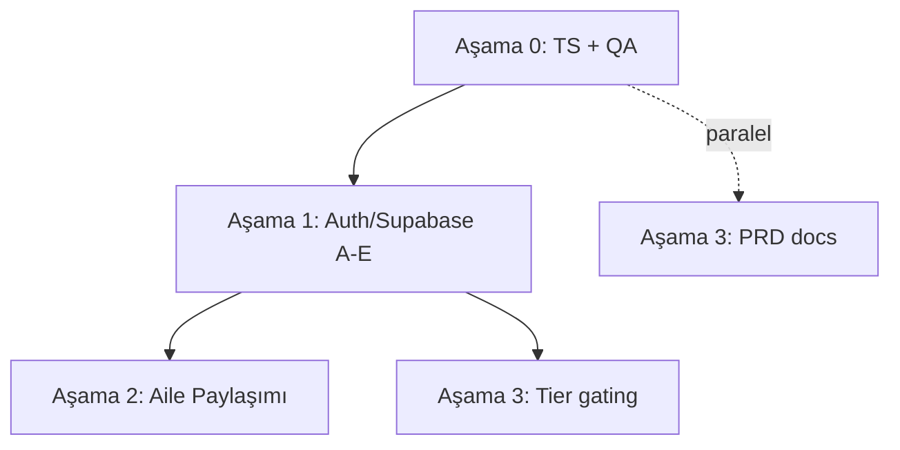

# İş Planı

**Oluşturulma:** 2026-06-22
**Kaynak:** `tasks/yapilacaklar.md` (devam eden + başlanmamış işler)

Bu dosya, `yapilacaklar.md`'deki açık işleri yürütme sırasına, bağımlılıklara ve tahminlere göre aşamalara böler. Mevcut durum kod tabanına bakılarak doğrulanmıştır.

---

## Mevcut durum (doğrulama)

| Alan | Durum |
|------|-------|
| TypeScript | `npx tsc --noEmit` → **5 hata / 4 dosya** (doğrulandı) |
| Auth | `app/(auth)/index.tsx` placeholder; "Continue as Guest" → doğrudan `(setup)/pet-type` |
| Bootstrap | `hooks/use-bootstrap.ts` auth'u atlıyor: `onboarding → setup → home` |
| User store | `provider: 'guest'`; `signIn/signOut/session` yok; Supabase SDK yok |

> **Guest kararı:** Canlı kullanıcı var ancak mevcut local veri korunmak zorunda değil (kullanıcılar yeniden profil oluşturacak). → Auth geçişinde **guest→hesap migration gerekmez**; temiz wipe yeterli.

---

## Bağımlılık akışı

**Yürütme sırası:** Aşama 0 (TS + QA paralel) → Aşama 1 (sıralı A→E) → Aşama 2 + Aşama 3 paralel.

---

## Aşama 0 — Temizlik & QA (devam eden)

Auth'a başlamadan kod tabanını yeşile çekmek. **Tahmini: ~0.5–1 gün.**

### 0.1 TypeScript hatalarını sıfırla (Öncelik 1)

Önerilen sıra (riskten bağımsıza):

- [x] **`hooks/use-color-scheme.ts` + `.web.ts`** — `return systemScheme ?? null`
- [x] **`services/notifications/schedule.ts`** — `reminderTime` null guard eklendi (null ise schedule atlanıyor)
- [x] **`app/(onboarding)/_layout.tsx` + `app/(setup)/_layout.tsx`** — `detachInactiveScreens` kaldırıldı (v54'te geçersiz prop; form state zaten `useSetupStore`'da)

**Sonuç:** `npx tsc --noEmit` temiz (exit 0), lint temiz. ✅

### 0.2 QA — kalan manuel testler (Öncelik 2, paralel)

- [ ] TR ↔ EN dil geçişi (tüm ekranlar)
- [ ] Daily Check-In Faz 5: dil geçişi, yeni kayıt + düzenleme, eski kayıt migration, VoiceOver / Reduce Motion
- [ ] Profile Tab matrisi T1–T12 + 2 pet ile delete akışı
- [ ] Multi-Pet matrisi T1–T10

**Çıktı:** `yapilacaklar.md` checkbox'ları işaretlenir; bulunan buglar ayrı maddeye düşülür.

---

## Aşama 1 — Auth / Supabase (başlanmamış, en kritik blok)

Aile Paylaşımı, Tier gating ve Sync hepsi buna bağlı. **Tahmini: ~3–5 gün.**

> Başlamadan önce `https://docs.expo.dev/versions/v54.0.0/` üzerinden `expo-secure-store`, Apple/Google auth ve Supabase Expo entegrasyonunu doğrula.

### Faz A — Supabase kurulum
- [ ] `@supabase/supabase-js` + `expo-secure-store` ekle
- [ ] Supabase projesi: Auth provider'lar (Apple, Google, Email)
- [ ] Env: `EXPO_PUBLIC_SUPABASE_URL`, `EXPO_PUBLIC_SUPABASE_ANON_KEY`
- [ ] `lib/supabase.ts` client (SecureStore session adaptörü)

### Faz B — Auth ekranı (zorunlu)
- [ ] `app/(auth)/index.tsx` gerçek UI: Apple / Google / Email
- [ ] **"Continue as Guest" kaldır**
- [ ] `use-bootstrap.ts`'e auth guard: oturum yoksa → `(auth)`, ana ekranlara erişim yok
- [ ] Hedef akış: `Splash → Onboarding → Auth (zorunlu) → Setup (pet yoksa) → Home`

### Faz C — User lifecycle
- [ ] `user.store`: `signIn`, `signOut`, session listener
- [ ] `currentUserId` ↔ Supabase `user.id`
- [ ] Pet → `ownerId` (Supabase user ID)
- [ ] Log Out → `(auth)`'a dön
- [ ] Delete Account → Supabase user sil + local wipe
- [ ] *(Guest migration gerekmez — temiz wipe)*

### Faz D — Free / Plus tier temeli
- [ ] `isPlusActive` (şimdilik Supabase metadata; RevenueCat sonra)
- [ ] Tier bazlı feature gating altyapısı (hook)

### Faz E — Sync (hazırlık)
- [ ] pets / check-ins / records → Supabase tabloları
- [ ] Offline-first strateji kararı: local store + cloud sync

---

## Aşama 2 — Aile Paylaşımı (başlanmamış, Lulu Plus)

**Bağımlılık:** Aşama 1 (A–E). **Tahmini: ~3–4 gün.**

### Faz A — Domain modeli
- [ ] `types/sharing.ts`: `CaregiverRole`, `PetInvite`, `SharedPet`
- [ ] Supabase tabloları: `pet_shares`, `invites`
- [ ] İzin matrisi: owner / editor / viewer

### Faz B — Supabase RLS & API
- [ ] Row Level Security: role bazlı pet erişimi
- [ ] Davet akışı: email / deep link
- [ ] Çakışma: iki caregiver aynı gün check-in güncellerse?

### Faz C — UI
- [ ] Pet Profile / Settings → "Share with Family"
- [ ] `isPlusActive === false` → upgrade CTA (Lulu Plus)
- [ ] `isPlusActive === true` → davet gönder / caregiver listesi

### Faz D — Store
- [ ] Aktif pet listesi: kendi pet'lerim + paylaşılanlar
- [ ] Paylaşılan pet'lerde rol bazlı UI (viewer = read-only)

---

## Aşama 3 — Tier farkları & Dokümantasyon (başlanmamış, küçük)

**Bağımlılık:** Tier için Aşama 1-D; PRD bağımsız (paralel). **Tahmini: ~0.5–1 gün.**

- [ ] Free vs Plus rapor özellik farkları — şimdilik tümü açık veya basit gating
- [ ] PRD Screen 17 güncelle: Profile hub + Settings ayrımı (Screen 17a / 17b)
- [ ] commit `docs: update PRD for profile hub and settings split`

---

## Gelecek (kapsam dışı, bağlantı noktaları)

| Konu | Bağımlılık |
|------|------------|
| StoreKit / RevenueCat | Lulu Plus gerçek IAP |
| Cloud sync / cross-device active pet | Auth + Supabase |
| Display name cloud sync | Auth + Supabase |
| My Pets'ten tek pet silme UI | v1 dışı |
| Pet başına notification prefs | v1 dışı |
