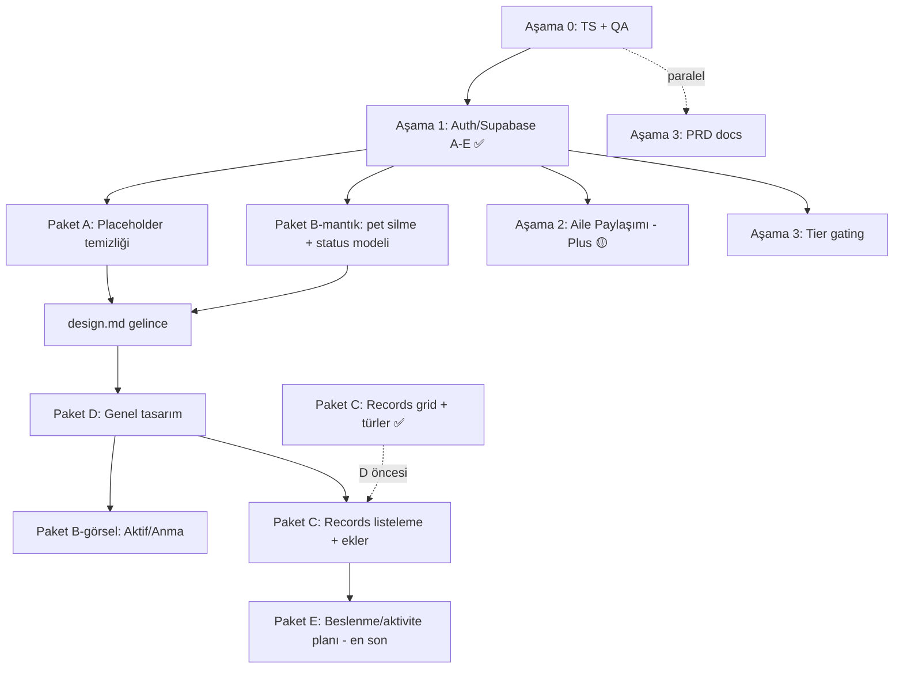

# İş Planı

**Oluşturulma:** 2026-06-22
**Kaynak:** `tasks/yapilacaklar.md` (devam eden + başlanmamış işler)

Bu dosya, `yapilacaklar.md`'deki açık işleri yürütme sırasına, bağımlılıklara ve tahminlere göre aşamalara böler. Mevcut durum kod tabanına bakılarak doğrulanmıştır.

---

## Mevcut durum (doğrulama)

**Son güncelleme:** 2026-07-05 — Lulu Plus IAP (RevenueCat) sandbox'ta doğrulandı; aile paylaşımı QA bekliyor

| Alan | Durum |
|------|-------|
| TypeScript | `npx tsc --noEmit` → **temiz (0 hata)** |
| Auth | Email/şifre + **Apple Sign In** çalışıyor; Google bekliyor |
| Bootstrap | `hooks/use-bootstrap.ts` auth guard aktif: `splash → onboarding → auth → setup → home` |
| User store | `signIn/signOut/session listener` + `currentUserId↔user.id`; Supabase client (`lib/supabase.ts`) |
| Sync | Pet/check-in/record/profil/reminder Supabase kaynak-doğruluk (write-through + pull) |
| Lulu Plus (IAP) | RevenueCat + paywall + tier gating + webhook → Supabase (`0015`/`0016`); sandbox 2–3 hesap test ✅ |
| Aile paylaşımı | Kod + gerçek Plus gating tamam (`0009` migration); manuel QA bekliyor |

> **Guest kararı:** Canlı kullanıcı var ancak mevcut local veri korunmak zorunda değil (kullanıcılar yeniden profil oluşturacak). → Auth geçişinde **guest→hesap migration gerekmez**; temiz wipe yeterli. (Hesap izolasyonu: farklı hesap girişinde yerel veri wipe; pet'ler buluttan geri gelir.)

---

## Bağımlılık akışı

**Yürütme sırası (klasik):** Aşama 0 (TS + QA paralel) → Aşama 1 (✅) → **Aşama 2 (🟡 kod + IAP ✅, QA)** → Aşama 3 paralel.

## Yeni paketler — yürütme sırası

Kullanıcı kararları (2026-06-22): **quick wins önce**, **B-görsel + C listeleme `design.md`'yi bekleyebilir**, **E en sona**. Paket C grid/tür kısmı referans görselle D öncesi uygulandı.

| Sıra | İş | Tasarıma bağlı? | Not |
|------|-----|------|-----|
| 1 | **Paket A** — placeholder temizliği & kararlar | Hayır | Mantık/metin; hemen |
| 2 | **Paket B-mantık** — pet silme UI bağlama + `status` modeli + migration | Hayır | `deletePet` zaten var |
| 3 | **Paket D** — genel tasarım | `design.md` gerekli | Token + component + ekranlar |
| 4 | **Paket B-görsel** — Aktif/Anma bölümleri | Evet (D sonrası) | D ile aynı dil |
| 5 | **Paket C** — Records tasarım & listeleme | Kısmen (grid + türler ✅) | Grid/türler referans görselle yapıldı; listeleme + ekler bekliyor |
| 6 | **Paket E** — beslenme/aktivite planı | — | En sona; yaklaşım kararı bekliyor |

> Paralel hatlar (bağımsız): Auth **Faz D (tier)**, **Aile Paylaşımı (Aşama 2)**, **PRD docs (Aşama 3)** istenirse araya alınabilir. Tier (Faz D), hem Aile Paylaşımı hem de Paket E'nin Plus gating'i için ön koşul olabilir.

---

## Aşama 0 — Temizlik & QA (devam eden)

Auth'a başlamadan kod tabanını yeşile çekmek. **Tahmini: ~0.5–1 gün.**

### 0.1 TypeScript hatalarını sıfırla (Öncelik 1)

Önerilen sıra (riskten bağımsıza):

- [x] **`hooks/use-color-scheme.ts` + `.web.ts`** — `return systemScheme ?? null`
- [x] **`services/notifications/schedule.ts`** — `reminderTime` null guard eklendi (null ise schedule atlanıyor)
- [x] **`app/(onboarding)/_layout.tsx` + `app/(setup)/_layout.tsx`** — `detachInactiveScreens` kaldırıldı (v54'te geçersiz prop; form state zaten `useSetupStore`'da)

**Sonuç:** `npx tsc --noEmit` temiz (exit 0), lint temiz. ✅

### 0.2 QA — kalan manuel testler (Öncelik 2, paralel)

- [ ] Aile paylaşımı matrisi: owner/member akışları, deep link → auth → join, inbox aktivite (2 hesap)
- [ ] EN ↔ DE dil geçişi (tüm ekranlar) — *Paket J kod tarafı ✅; manuel QA bekliyor*
- [ ] Daily Check-In Faz 5: dil geçişi, yeni kayıt + düzenleme, eski kayıt migration, VoiceOver / Reduce Motion
- [ ] Profile Tab matrisi T1–T12 + 2 pet ile delete akışı
- [ ] Multi-Pet matrisi T1–T10

**Çıktı:** `yapilacaklar.md` checkbox'ları işaretlenir; bulunan buglar ayrı maddeye düşülür.

---

## Aşama 1 — Auth / Supabase (devam ediyor — email + pet sync tamam)

Aile Paylaşımı, Tier gating ve Sync hepsi buna bağlı.

> Native auth kararı: Apple = `expo-apple-authentication`, Google = `@react-native-google-signin/google-signin`, ardından `supabase.auth.signInWithIdToken`. Native test için **development build** gerekir (Expo Go yetmez).

### Faz A — Supabase kurulum ✅
- [x] `@supabase/supabase-js` + `expo-secure-store` (+ apple-auth, google-signin, dev-client, aes-js, url-polyfill, get-random-values)
- [x] Env: `EXPO_PUBLIC_SUPABASE_URL`, `EXPO_PUBLIC_SUPABASE_ANON_KEY` (`.env` + `.env.example`)
- [x] `lib/supabase.ts` client (`LargeSecureStore` — AES'li SecureStore session adaptörü)
- [x] `app.json`: bundle id `com.luluapp.app`, `usesAppleSignIn`, plugin'ler; `eas.json` dev build profilleri
- [x] Supabase provider'lar: **Email** ✅ + **Apple** ✅; **Google** kapalı

### Faz B — Auth ekranı (zorunlu) ✅ (email + Apple)
- [x] `app/(auth)/index.tsx` gerçek email/şifre UI (giriş ↔ kayıt, validasyon, i18n en/de)
- [x] **"Continue as Guest" kaldırıldı**
- [x] `use-bootstrap.ts` auth guard: oturum yoksa → `(auth)`
- [x] Akış: `Splash → Onboarding → Auth → Setup (pet yoksa) → Home`
- [x] **Apple** butonu → `signInWithIdToken` (fiziksel iPhone dev build ile test edildi)
- [ ] **Google** butonu → bkz. "Google Sign In" bölümü

### Faz C — User lifecycle 🟡
- [x] `user.store`: `signInWithEmail`, `signUpWithEmail`, `signOut`, session listener
- [x] `currentUserId` ↔ Supabase `user.id`
- [x] Pet → `user_id` (Supabase user ID; cloud `pets` tablosu)
- [x] Log Out → `(auth)`'a dön (LegalCard bağlandı)
- [x] Delete Account → Supabase user sil + local wipe (`delete_user` SECURITY DEFINER RPC, `0003_delete_user.sql`; cascade + avatar storage temizliği; ardından `signOut('local')` + `deleteAllLocalData`)

### Faz D — Free / Plus tier temeli ✅
- [x] `isPlusActive` — RevenueCat client + Supabase `profiles` (`plus_active`); webhook sync (`0016`)
- [x] Tier bazlı feature gating (`usePlusFeature`, sunucu limitleri `0015`)
- [x] Paywall (`LuluPlusPaywall`), profil kartı, restore / manage subscription
- [x] Sandbox satın alma + Free/Plus limitleri test edildi (2–3 hesap)

### Faz E — Sync 🟡 (pet + check-in + record tamam)
- [x] Supabase şeması: `pets` / `check_ins` / `pet_records` + RLS + `updated_at` trigger (`supabase/migrations/0001_init.sql`)
- [x] **Pets sync**: kaynak-doğruluk; write-through (create/update/delete) + giriş/açılışta pull; ilk açılışta yerel→bulut migrasyon
- [x] **Check-ins sync** (`services/sync/check-ins-sync.ts`): write-through + pull; yerel→bulut migrasyon
- [x] **Records sync** (`services/sync/records-sync.ts`): write-through + pull; yerel→bulut migrasyon
- [x] **Profil sync** (`services/sync/profile-sync.ts`): isim + avatar; avatar → Supabase Storage (`avatars` bucket), `profiles` tablosu (`0002_profiles.sql`)
- [x] Pull sırası: pets → check-ins → records → profile; hesap izolasyonu/pet silme yerel cascade temizliği
- [x] Pet fotoğrafı → Supabase Storage (`pet-photos` bucket + RLS, `0004_pet_photos.sql`; `uploadPetPhoto`/`deletePetPhotoFiles`; edit-pet seçim anında yükler; pet/hesap silmede temizlik)
- [ ] *(İleri faz)* Gerçek offline-first kuyruk + last-write-wins çakışma çözümü (şimdilik online write-through best-effort)

---

## Aşama 2 — Aile Paylaşımı (🟡 kod + IAP tamam, QA bekliyor)

**Bağımlılık:** Aşama 1 (A–E). **Tahmini kalan:** ~1 gün manuel QA.

**Kilitli kararlar (2026-07-05):** Davet = kod + deep link. Rol = owner + member. Test = dev bypass. **Join path:** onboarding atlanır (K25), fork auth sonrası (K26), Home reminders kartı (K27), display name sor (K28).

> Uygulanan mimari: `family_groups` + `pet_memberships` — orijinal plandaki `pet_shares` / `invites` / editor-viewer yerine.

### Faz A — Domain modeli ✅
- [x] `types/sharing.ts`: `FamilyGroup`, `PetMembership`, `ActivityEvent`
- [x] `types/pet.ts`: `sharingRole`, `ownerUserId`
- [x] Supabase: `0009_family_sharing.sql` (migration uygulandı)

### Faz B — Supabase RLS & API ✅
- [x] RLS + helper functions (`has_pet_access`, vb.)
- [x] RPC: `preview_family_join`, `accept_family_join`, `log_activity_event`
- [x] Davet: kod + deep link (`lulu://join/CODE`)
- [ ] Çakışma: iki caregiver aynı gün check-in — ileri faz (sync kuyruk)

### Faz C — UI ✅
- [x] `/family-sharing`, `/join-family`
- [x] Settings + Pet Profile giriş; Plus paywall / dev bypass

### Faz D — Store & sync ✅
- [x] `sharing.store.ts`, `family-sharing.ts`, `pets-sync` sharingRole
- [x] My Pets: owned + shared; shared badge

### Faz E — Rol bazlı UI ✅ (kod)
- [x] `pet-access.ts` guard'ları; edit-pet redirect; reports gating; care data `canWritePetCareData`
- [ ] *(QA)* Member uçtan uca

### Faz F — Aktivite & inbox ✅
- [x] Sync activity logging; inbox family provider; `member_left`; create/update check-in ayrımı
- [ ] *(Opsiyonel)* Push bildirimleri

### Faz G — Post-auth join ✅
- [x] `resolve-post-auth-route.ts`; bootstrap + auth `joinCode` param

### Faz H — Join path (setup bypass) 🟡 uygulandı — QA bekliyor

Detay: `yapilacaklar.md` §4 Faz H.

- [x] Path choice, onboarding atlama, display name, join finalize, Home reminders kartı
- [ ] *(QA)* Join path uçtan uca + owner regresyon

### Kalan
- [ ] **Faz H** (join path — yukarı)
- [ ] Manuel QA (2 hesap / 2 cihaz)
- [ ] Bilinen sorunlar — `yapilacaklar.md` §4 alt bölüm (kullanıcı ekleyecek)
- [ ] *(v2)* editor/viewer rolleri

---

## Aşama 3 — Tier farkları & Dokümantasyon (başlanmamış, küçük)

**Bağımlılık:** Tier için Aşama 1-D; PRD bağımsız (paralel). **Tahmini: ~0.5–1 gün.**

- [ ] Free vs Plus rapor özellik farkları — şimdilik tümü açık veya basit gating
- [ ] PRD Screen 17 güncelle: Profile hub + Settings ayrımı (Screen 17a / 17b)
- [ ] commit `docs: update PRD for profile hub and settings split`

---

## Paket A — Placeholder temizliği & kararlar (tasarımdan bağımsız, ilk) — 🟢 büyük ölçüde tamam

**Detay:** `yapilacaklar.md` → "Yeni iş paketleri → A".

- [x] A2: Community **Rate Lulu** — yanıltıcı "Çok Yakında" kaldırıldı; in-app prompt uygun değilse mağaza sayfası açılıyor (`APP_STORE_REVIEW_URL`)
- [x] A3: Records **Attachments** — placeholder + modal + component kaldırıldı; gerçek ek **Paket C**'ye taşındı
- [x] A4: `deletePet` UI'a bağlandı (Paket B1)
- [x] A1: Lulu Plus — gerçek IAP (`LuluPlusCard` + `LuluPlusPaywall` + RevenueCat)
- [x] `ComingSoonModal` kullanımları gözden geçirildi (Lulu Plus artık paywall kullanıyor)

## Paket B — Pet silme + status modeli — ✅ B1 + B2 tamam

**Not:** Görsel Aktif/Anma ayrımı şimdilik basit bölüm (`GroupedSection`) olarak yapıldı; Paket D (design.md) sonrası cilalanacak.

- [x] B1: **Edit Pet** ekranına "Delete Pet" (isim onayı + `DeletePetConfirmModal`) + i18n → `usePetStore.deletePet`
- [x] B1: Silme yönlendirmesi (tek pet → setup; çoklu → home) + guard'lar + iOS header fix
- [ ] B1: *(QA)* Son pet / aktif pet silme — kullanıcı tekli/çoklu onayladı; matris maddesi açık
- [x] B2: `types/pet.ts` + `storage/pet.storage.ts` + yerel migration v10 → `status: 'active' | 'deceased'` (+ `deceasedAt`)
- [x] B2: Supabase migration `0005_pet_status.sql` (`status`/`deceased_at`) + `pets-sync.ts` map
- [x] B2: "Mark as deceased" / "Restore" aksiyonu (Edit Pet, geri alınabilir, `ConfirmModal` + i18n) → `usePetStore.setPetStatus`
- [x] B2: Davranış — reminder otomatik iptal, aktif pet olamaz/yeni check-in yok, geçmiş salt-okunur (Home/check-in/records gating); `getActivePet` aktif pet tercih eder
- [x] B2: My Pets "Aktif" / "Anma" bölüm ayrımı (basit; D sonrası cilalanacak)
- [ ] B2: *(QA)* Vefat işaretle/geri al akışını cihazda doğrula

## Paket D — Genel tasarım (`design.md` mevcut)

**Tahmini: design.md kapsamına bağlı.** Detay: `yapilacaklar.md` → "D". **Paket I** ile koordine: v1 Dark-only.

- [ ] `design.md` analizi → tasarım dili, palet, tipografi, spacing, component stilleri
- [ ] `constants/theme.ts` — Dark token güncelle (Light kodda kalır, kullanıcıya kapalı)
- [ ] Ortak component'ler (Button, Card, ScreenContainer, list row'lar)
- [ ] Ekran ekran uygulama + Dynamic Type doğrulama

## Paket B (görsel) — Aktif / Anma bölümleri (Paket D sonrası)

- [ ] My Pets: "Aktif" + "Anma / Vefat edenler" bölümleri (yeni tasarım dilinde)
- [ ] Vefat eden pet için memorial kart/rozet stili

## Paket C — Records tasarım & listeleme — 🟡 kısmen tamam

**Not:** Grid ve kayıt türleri, `design.md` beklemeden referans görselle uygulandı. Listeleme ve ekler sonraki iterasyonda.

**Yapıldı ✅**
- [x] **C1 — Grid tasarımı:** 4 sütun pastel ikon grid, kısa grid etiketleri, "Kayıt Oluştur" bölüm başlığı; grid üstte / Son Kayıtlar altta (`90fd4d6`)
- [x] **C2 — Kayıt türleri:** 8 tür (Veteriner, Aşı, Parazit, İlaç, Semptom, Kilo, Operasyon, Test Sonuçları); formlar + validasyon + i18n (`e7bec09`)
- [x] **C3 — Semptom:** serbest metin + öneri chip'leri + opsiyonel şiddet
- [x] **C4 — Legacy migrasyon:** `vomiting`/`other` → `symptom`; SQLite v11 + Supabase `0006` + `pet-record-normalize.ts`

**Kalan**
- [ ] **C5 — Son Kayıtlar listeleme:** gruplama/filtre/arama/"tümünü gör"
- [ ] **C6 — İkon seti:** kullanıcıdan gelecek yeni ikonlarla `record-types.ts` güncelle
- [ ] **C7 — Attachments (A3):** foto/PDF → Supabase Storage
- [ ] Paket D sonrası Records görsel cilalama (genel design system ile uyum)

## Paket E — Beslenme / aktivite planı (en son, karar bekliyor)

**Açık kararlar (re-plan):** kural tabanlı vs AI · Free vs Plus · sadece beslenme mi aktivite de mi · içerik kaynağı/sorumluluk.

- [ ] Yaklaşım kararı sonrası detaylı plan (`types/plan.ts`, üretim motoru, UI konumu, tier gating, i18n en/de, disclaimer)

---

## Paket F–K — Yayın öncesi UX (2026-06-24)

Detay: `yapilacaklar.md` → "Yayın öncesi UX paketleri". **Önerilen sıra:** ~~J~~ ✅ · ~~I~~ ✅ · ~~G~~ ✅ · D (tasarım) · F+K (ekranlar) · H (Home empty).

| Paket | Konu | Durum | Tasarıma bağlı? |
|-------|------|-------|-----------------|
| F | Auth giriş & kayıt ekranları | ⬜ Başlanmadı | Evet (D) |
| G | Pet ekleme / setup ekranları | ✅ Tamamlandı | — |
| H | Home boş durum & yönlendirme | ⬜ Başlanmadı | Evet (D) |
| I | Tek tema — Dark-first (Light sonra) | ✅ Tamamlandı | — |
| J | EN + DE; TR kaldır | ✅ Tamamlandı | Hayır |
| K | Bildirim ekranları & mesajları | ⬜ Başlanmadı | Kısmen (D) |

---

## Native sosyal giriş — Apple ✅ / Google ⬜

### Apple Sign In ✅ (2026-07-04)
- [x] Apple Developer credential'ları + Supabase Apple provider
- [x] `signInWithApple` → `signInWithIdToken`; auth ekranı + `user.store`
- [x] Fiziksel iPhone dev build ile test edildi

### Google Sign In ⬜
- [ ] Google Cloud OAuth credential'ları
- [ ] Supabase dashboard: Google provider aç
- [ ] `EXPO_PUBLIC_GOOGLE_WEB_CLIENT_ID` + `EXPO_PUBLIC_GOOGLE_IOS_CLIENT_ID`
- [ ] Google butonu → `signInWithIdToken`
- [ ] Fiziksel cihazda test (dev build)

---

## Gelecek (kapsam dışı, bağlantı noktaları)

| Konu | Bağımlılık |
|------|------------|
| Aile paylaşımı QA | Manuel test (owner/member/deep link/inbox) |
| Android IAP | RevenueCat yalnızca iOS; Play Store sonra |
| Production IAP smoke test | App Store yayını sonrası ilk gerçek satın alma |
| Cloud sync / cross-device active pet | Auth + Supabase |
| My Pets'ten tek pet silme UI | ✅ Paket B1 |
| Pet başına notification prefs | v1 dışı |
