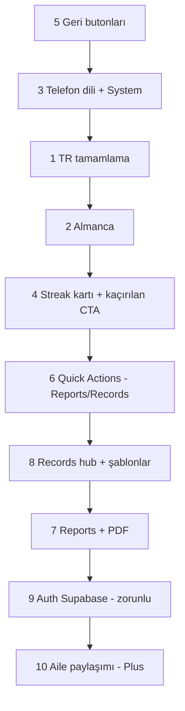
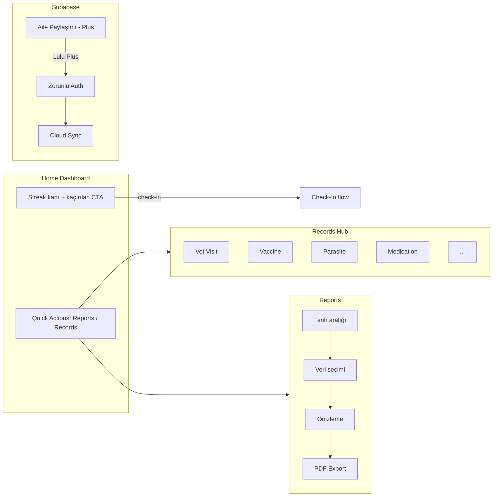

# Yapılacaklar — Kalan İşler

Uygulamanın bir sonraki geliştirme döngüsü için önceliklendirilmiş yol haritası.

**Son güncelleme:** 2026-06-21  
**Durum:** Sprint 3 tamamlandı — **Sprint 4 sırada**

---

## Kilitlemiş kararlar

| # | Konu | Karar |
|---|------|-------|
| K1 | "Check-In" terimi | Tüm dillerde ürün terimi olarak **"Check-In"** kalır (çevrilmez) |
| K2 | Dil seçimi | Settings'te **System / Automatic** seçeneği olacak |
| K3 | Irk (breed) isimleri | Hedef dildeki karşılığı gösterilir (TR → Van Kedisi, DE → Türkisch Van vb.) |
| K4 | Check-in kartları | Genel taşma sorunu giderilecek; kart tasarımları iyileştirilecek |
| K5 | Check-in görselleştirme | Line chart yok; mevcut streak/pill modeli + tamamlanma oku yeterli |
| K6 | Start Check-In butonu | **Kaldırılacak** — check-in girişi streak kartından |
| K7 | Kaçırılan check-in | Streak kartı içinde bağlamsal CTA: *"Bugün check-in yapmadın"*, *"Dünü tamamla"* vb. |
| K8 | Medication | Ayrı Quick Action değil; **Records içinde** şablon olarak |
| K9 | Records yapısı | Hub ekranı + olay tipi butonları (şimdilik butonlar; formlar sonra) |
| K10 | Records olay tipleri (v1 butonlar) | Vet ziyareti, aşı, parazit, Medication, … |
| K11 | Fotoğraf / dosya | Evet, ama **şimdilik placeholder** |
| K12 | Reports veri seçimi | Kullanıcı tarih aralığı + **hangi verilerin gösterileceğini** seçer; hepsi otomatik dahil değil |
| K13 | PDF export | **Evet** — Reports MVP'de PDF export olacak |
| K14 | Backend | **Supabase** |
| K15 | Guest modu | **Kaldırılacak** — tüm kullanıcılar auth zorunlu |
| K16 | Ücretsiz / ücretli | İki tier (Free + Lulu Plus); ikisi de auth gerektirir |
| K17 | Auth ekranı | **Zorunlu** — onboarding sonrası giriş şart |
| K18 | Aile paylaşımı | **Lulu Plus** aboneliği arkasında |

---

## Öncelik sırası

| Sıra | # | İş | Öncelik gerekçesi |
|------|---|-----|-------------------|
| 1 | 5 | Geri butonları — gereksiz metinleri kaldır | Küçük kapsam, sıfır bağımlılık; tüm ekranlarda anında UX iyileşmesi |
| 2 | 3 | Uygulama dili → telefon diline göre | i18n altyapısının temeli; TR/DE/EN genişletmesinden önce netleşmeli |
| 3 | 1 | Türkçe dil desteğini tamamlama | Mevcut kısmi çalışma; ana akış dışındaki tüm ekranlar hâlâ İngilizce |
| 4 | 2 | Almanca dil desteği | TR tamamlandıktan sonra aynı `i18n/` şemasına `de.ts` eklenir |
| 5 | 4 | Daily Check-in streak kartı iyileştirmeleri | Çekirdek özellik (Home); kaçırılan check-in CTA'ları burada |
| 6 | 6 | Quick Actions düzenleme | Reports / Records rotaları; Medication ve Start Check-In kaldırılır |
| 7 | 8 | Records detaylandırma | Olay tipi şablonları hub'ı; Reports'un veri kaynağı |
| 8 | 7 | Reports — tarih aralığı + veri seçimi + PDF | Kullanıcı seçimli rapor + PDF export |
| 9 | 9 | Auth (Supabase) | Guest kaldırılır; zorunlu giriş; Free/Plus tier temeli |
| 10 | 10 | Aile paylaşımı hazırlık | Lulu Plus arkasında; Auth + Supabase sonrası |



---

## 5 — Geri butonları (sıra: 1)

### Mevcut durum

- **Wizard ekranları** (onboarding, setup): `ScreenHeader` → zaten sadece ok.
- **Stack ekranları** (Settings, Pet Profile, Edit Pet, Check-In): iOS'ta önceki ekran başlığı geri butonu yanında metin olarak görünüyor.

### Yapılacaklar

- [x] Tüm stack ekranlarında minimal geri butonu (`headerBackButtonDisplayMode: 'minimal'` — `STACK_BACK_ONLY_OPTIONS`)
- [x] Android tutarlılık kontrolü (aynı `STACK_BACK_ONLY_OPTIONS` kullanılıyor)
- [x] `ScreenHeader` içindeki kullanılmayan `backLabel` prop'unu temizle

### Kabul kriterleri

| # | Senaryo | Beklenen |
|---|---------|----------|
| S1 | Profile → Settings | Sadece geri oku |
| S2 | Pet Profile → Edit Pet | Sadece geri oku |
| S3 | Home → Check-In | Sadece geri oku |

---

## 3 — Uygulama dili telefon diline göre (sıra: 2)

### Kilitlemiş kararlar

- Settings'te **System / Automatic** seçeneği olacak (K2)
- Desteklenmeyen cihaz dili → fallback `en`
- Manuel seçim yapıldığında kayıtlı tercih geçerli; System seçiliyken her açılışta cihaz dili okunur

### Yapılacaklar

- [x] `expo-localization` ekle (Expo SDK 54 uyumlu sürüm)
- [x] `AppLanguagePreference` genişlet: `'system' | 'en' | 'tr' | 'de'`
- [x] `resolveDeviceLanguage()` — cihaz locale → desteklenen dil eşlemesi
- [x] İlk açılış (kayıt yok): `system` → cihaz dili
- [x] `LanguageSection`: System, English, Türkçe, Deutsch
- [x] Delete Account sonrası → `system` (cihaz diline dön)

### Kabul kriterleri

| # | Senaryo | Beklenen |
|---|---------|----------|
| S1 | TR telefon, ilk kurulum, System | Türkçe |
| S2 | Kullanıcı EN seçti | İngilizce kalır (System'e dönene kadar) |
| S3 | System seçili, telefon DE | Almanca (DE eklendikten sonra) |
| S4 | FR telefon, System | Fallback İngilizce |

---

## 1 — Türkçe dil desteğini tamamlama (sıra: 3)

### Kilitlemiş kararlar

- "Check-In" terimi çevrilmez (K1)
- Breed isimleri hedef dilde gösterilir (K3)

### Yapılacaklar

#### Faz A — Ekran kapsamı
- [x] Tab bar, Onboarding, Setup, Profile, My Pets, Dashboard, Pet Profile / Edit Pet
- [x] Ortak UI modalları ve alert metinleri

#### Faz B — Dinamik içerik
- [x] Push bildirim metinleri
- [x] Tarih / gün kısaltmaları → seçili locale
- [x] Breed listesi: locale-aware gösterim katmanı (`usePetDisplay().displayPetBreed`)

#### Faz C — Kalite
- [x] Kart taşma düzeltmeleri (streak kartı + Today's Summary — K4 ile koordineli)
- [ ] EN ↔ TR geçiş QA (manuel)

### Kabul kriterleri

| # | Senaryo | Beklenen |
|---|---------|----------|
| S1 | Dil = Türkçe | Kullanıcıya görünen metinler Türkçe ("Check-In" hariç) |
| S2 | Breed gösterimi TR | Van Kedisi, Ankara Kedisi vb. |
| S3 | Bildirim | Türkçe başlık + gövde |

---

## 2 — Almanca dil desteği (sıra: 4)

### Kilitlemiş kararlar

- "Check-In" Almanca'da da çevrilmez (K1)
- Breed isimleri Almanca karşılıklarıyla (K3)

### Yapılacaklar

- [x] `i18n/de.ts` — tam `Translations` implementasyonu
- [x] Settings → Deutsch
- [x] Cihaz dili eşlemesi: `de` → `de` (`resolveDeviceLanguage`)
- [x] Breed listesi DE karşılıkları

### Kabul kriterleri

| # | Senaryo | Beklenen |
|---|---------|----------|
| S1 | Settings → Deutsch | Tüm çevrilmiş ekranlar Almanca |
| S2 | DE cihaz + System | Otomatik Almanca |

---

## 4 — Daily Check-in streak kartı (sıra: 5)

### Kilitlemiş kararlar

- Line chart yok; pill/streak modeli + tamamlanma oku yeterli (K5)
- Kartlarda taşma düzeltilecek, genel tasarım iyileştirilecek (K4)
- Start Check-In butonu kaldırılacak (K6)
- Kaçırılan check-in CTA'ları streak kartı içinde (K7)

### Mevcut durum

- `DailyCheckInProgress` = 7 günlük pill'ler
- `TodaysCheckInCard` = bugünün özeti
- Ayrı "Start Check-In" primary butonu Dashboard'da

### Hedef wireframe

```
┌─────────────────────────────────────┐
│  Daily Check-In                     │
│  ⚠ Bugün check-in yapmadın          │  ← bağlamsal banner (bugün eksik)
│  [ Pt ] [ Sa ] [ Ça ] [ Pe ] ...   │  ← haftalık pill'ler
│  [ Dünü tamamla → ]                 │  ← dün eksikse CTA
├─────────────────────────────────────┤
│  Today's Summary                    │  ← taşma düzeltilmiş kart
│  ...                                │
└─────────────────────────────────────┘
```

### Yapılacaklar

- [x] `DailyCheckInProgress` — spacing, taşma, tipografi, tamamlanma oku
- [x] Kaçırılan gün tespiti: bugün / dün
- [x] Bağlamsal CTA metinleri (i18n): *"Bugün check-in yapmadın"*, *"Dünü tamamla"*
- [x] CTA tap → `/check-in?date=YYYY-MM-DD`
- [x] `TodaysCheckInCard` layout düzeltmesi (taşma)
- [x] Dashboard'dan **Start Check-In** primary butonunu kaldır
- [x] Gün etiketleri → seçili locale (`formatWeekdayShort` + `getLocaleTag`)

### Kabul kriterleri

| # | Senaryo | Beklenen |
|---|---------|----------|
| S1 | Bugün check-in yok | Streak kartında bugün CTA görünür |
| S2 | Dün eksik, bugün tamam | "Dünü tamamla" CTA görünür |
| S3 | Hafta tam | CTA yok, yalnızca pill'ler |
| S4 | Uzun TR metin | Taşma yok |
| S5 | Dashboard | Ayrı Start Check-In butonu yok |

---

## 6 — Quick Actions düzenleme (sıra: 6)

### Kilitlemiş kararlar

- Medication ayrı tile değil → Records içinde (K8)
- Start Check-In butonu yok → streak kartında (K6, K7)

### Hedef

Quick Actions yalnızca **Reports** ve **Records** — 2 tile'lı grid.

```
┌─────────────────────────────────────┐
│  Quick Actions                      │
│  ┌──────────────┐ ┌──────────────┐  │
│  │   Reports    │ │   Records    │  │
│  └──────────────┘ └──────────────┘  │
└─────────────────────────────────────┘
```

### Yapılacaklar

- [x] Medication tile kaldır
- [x] Start Check-In primary buton kaldır (streak kartına taşındı — Sprint 2)
- [x] `constants/quick-actions.ts` — Reports + Records tanımları
- [x] Reports → `/reports`, Records → `/records`
- [x] i18n etiketleri (mevcut `dashboard.reports` / `dashboard.records`)
- [x] 2'li grid layout

### Kabul kriterleri

| # | Senaryo | Beklenen |
|---|---------|----------|
| S1 | Dashboard | Yalnızca Reports + Records tile |
| S2 | Records tap | `/records` hub |
| S3 | Reports tap | `/reports` sihirbazı |
| S4 | Medication | Quick Action'da görünmez |

---

## 8 — Records detaylandırma (sıra: 7)

### Kilitlemiş kararlar

- Hub + olay tipi butonları; şimdilik butonlar, formlar kademeli (K9, K10)
- Medication Records altında (K8)
- Fotoğraf/dosya: placeholder (K11)

### Hedef wireframe (v1)

```
┌─────────────────────────────────────┐
│  ← Records                          │
├─────────────────────────────────────┤
│  Add a record                       │
│  ┌─────────────────────────────────┐│
│  │ 🏥 Vet Visit                  › ││
│  │ 💉 Vaccine                    › ││
│  │ 🐛 Parasite Treatment         › ││
│  │ 💊 Medication                 › ││
│  │ 🤮 Vomiting                   › ││
│  │ ⚖️ Weight                     › ││
│  │ ···                           › ││
│  └─────────────────────────────────┘│
│  (tap → şimdilik ComingSoon / placeholder form) │
└─────────────────────────────────────┘
```

### Olay tipleri (v1 butonlar)

| Tip | Not |
|-----|-----|
| Vet Visit | Ziyaret kaydı |
| Vaccine | Aşı |
| Parasite Treatment | Parazit |
| Medication | İlaç / doz |
| Vomiting | Kusma vb. ani olaylar |
| Weight | Kilo ölçümü |
| Other | Serbest not |

### Yapılacaklar

#### Faz A — Hub (şimdilik)
- [x] `app/records/index.tsx` — olay tipi buton listesi
- [x] `constants/record-types.ts` — tip tanımları (ikon, i18n key)
- [x] Her buton → `ComingSoonModal` (formlar Sprint 4'te)

#### Faz B — Veri modeli (şablonlar açılırken)
- [x] `types/pet-record.ts` — record type enum, tarih, petId, metadata
- [x] SQLite migration — `pet_records` tablosu
- [x] `storage/` + `stores/` CRUD

#### Faz C — Şablon formları (kademeli)
- [ ] Vet Visit formu
- [ ] Vaccine formu
- [ ] Parasite formu
- [ ] Medication formu
- [ ] Diğer tipler

#### Faz D — Ekler
- [ ] Fotoğraf / dosya ekleme UI — **placeholder** (K11)
- [ ] i18n TR / DE / EN

### Kabul kriterleri

| # | Senaryo | Beklenen |
|---|---------|----------|
| S1 | Records aç | Olay tipi butonları listelenir |
| S2 | Medication tap | Medication şablonuna gider (veya placeholder) |
| S3 | Fotoğraf ekle | Placeholder UI görünür, işlev sonra |
| S4 | TR dil | Tüm buton etiketleri Türkçe |

---

## 7 — Reports (sıra: 8)

### Kilitlemiş kararlar

- Kullanıcı tarih aralığı + hangi verilerin dahil edileceğini seçer (K12)
- PDF export MVP'de var (K13)
- Tüm veri otomatik dahil değil

### Hedef akış

```
Adım 1: Tarih aralığı (7 gün / 30 gün / 3 ay / özel)
    ↓
Adım 2: Veri seçimi (checkbox)
         ☐ Appetite  ☐ Energy  ☐ Pee  ☐ Poop
         ☐ Vet visits  ☐ Vaccines  ☐ Medication  ...
    ↓
Adım 3: Önizleme
    ↓
Adım 4: PDF Export / Share
```

### Yapılacaklar

#### Faz A — Sihirbaz
- [ ] `app/reports/index.tsx` — çok adımlı akış
- [ ] Tarih aralığı seçici
- [ ] Veri seçimi: check-in kategorileri + records tipleri (ayrı ayrı seçilebilir)

#### Faz B — Rapor şablonu
- [ ] Yalnızca seçilen verileri içeren önizleme
- [ ] Pet bilgisi header (isim, tür, ırk, yaş)
- [ ] Veteriner paylaşımına uygun statik layout

#### Faz C — PDF export
- [ ] PDF oluşturma (ör. `expo-print` veya `react-native-html-to-pdf`)
- [ ] `Share.share` ile paylaşım

#### Faz D — Tier (gelecek)
- [ ] Free vs Plus rapor özellik farkları — şimdilik tümü açık veya basit gating

### Kabul kriterleri

| # | Senaryo | Beklenen |
|---|---------|----------|
| S1 | 30 gün, yalnızca appetite + poop | Önizlemede sadece bunlar |
| S2 | Vet visits seçilmedi | Raporda vet verisi yok |
| S3 | Veri yok | Boş durum mesajı |
| S4 | Export PDF | PDF oluşur, share sheet açılır |

---

## 9 — Auth — Supabase (sıra: 9)

### Kilitlemiş kararlar

- Backend: **Supabase** (K14)
- Guest modu **kaldırılacak** (K15)
- Auth **zorunlu** (K17)
- Free + Lulu Plus tier; ikisi de auth gerektirir (K16)

### Mevcut durum

- Guest-only placeholder auth ekranı
- Bootstrap auth'u atlıyor
- `currentUserId` tanımlı ama kullanılmıyor
- Supabase SDK yok

### Yapılacaklar

#### Faz A — Supabase kurulum
- [ ] `@supabase/supabase-js` + `expo-secure-store` (session)
- [ ] Supabase proje: Auth providers (Apple, Google, Email)
- [ ] Env config (`EXPO_PUBLIC_SUPABASE_URL`, `ANON_KEY`)

#### Faz B — Auth ekranı (zorunlu)
- [ ] `app/(auth)/index.tsx` — Apple / Google / Email giriş
- [ ] **"Continue as Guest" kaldır**
- [ ] Onboarding sonrası → `(auth)` (bootstrap guard)
- [ ] Oturum yoksa hiçbir ana ekrana erişim yok

#### Faz C — User lifecycle
- [ ] `user.store` — `signIn`, `signOut`, session dinleme
- [ ] `currentUserId` ↔ Supabase `user.id`
- [ ] Pet → `ownerId` (Supabase user ID)
- [ ] Log Out → auth ekranına dön
- [ ] Delete Account → Supabase user silme + local wipe

#### Faz D — Free / Plus tier temeli
- [ ] `isPlusActive` — Supabase metadata veya RevenueCat (sonra)
- [ ] Tier'a göre özellik gating altyapısı (aile paylaşımı, raporlar vb.)

#### Faz E — Sync (hazırlık)
- [ ] Pets, check-ins, records → Supabase tabloları
- [ ] Offline-first: local SQLite + cloud sync stratejisi

### Bootstrap akışı (yeni)

```
Splash
  → Onboarding (ilk kez)
  → Auth (zorunlu — oturum yoksa)
  → Setup (pet yoksa)
  → Home
```

### Kabul kriterleri

| # | Senaryo | Beklenen |
|---|---------|----------|
| S1 | Yeni kullanıcı | Auth ekranı; guest seçeneği yok |
| S2 | Oturum yok | Ana ekranlara erişim engelli |
| S3 | Apple ile giriş | Supabase session, Home'a yönlendirme |
| S4 | Log Out | Auth ekranına dön |
| S5 | Delete Account | Remote + local veri silinir |

---

## 10 — Aile paylaşımı hazırlık (sıra: 10)

### Kilitlemiş kararlar

- **Lulu Plus** aboneliği gerekli (K18)
- Backend: Supabase (K14)
- Auth zorunlu (K17)

### Yapılacaklar

#### Faz A — Domain modeli
- [ ] `types/sharing.ts` — `CaregiverRole`, `PetInvite`, `SharedPet`
- [ ] Supabase tabloları: `pet_shares`, `invites`
- [ ] İzin matrisi: owner / editor / viewer

#### Faz B — Supabase RLS & API
- [ ] Row Level Security: pet erişimi role göre
- [ ] Davet akışı: email / deep link
- [ ] Çakışma: iki caregiver aynı gün check-in güncellerse?

#### Faz C — UI
- [ ] Pet Profile veya Settings → "Share with Family"
- [ ] `isPlusActive === false` → upgrade CTA (Lulu Plus)
- [ ] `isPlusActive === true` → davet gönder / caregiver listesi

#### Faz D — Store
- [ ] Aktif pet listesi: kendi pet'lerim + paylaşılanlar
- [ ] Paylaşılan pet'lerde rol bazlı UI (viewer = read-only)

### Açık noktalar (düşük öncelik — uygulama sırasında netleşir)

- Maksimum caregiver sayısı
- Pet sitter için süre sınırlı davet
- Offline cache politikası

### Kabul kriterleri

| # | Senaryo | Beklenen |
|---|---------|----------|
| S1 | Free kullanıcı | Paylaşım kilitli, Plus upgrade CTA |
| S2 | Plus kullanıcı | Davet gönderebilir |
| S3 | Caregiver kabul | Pet listesinde görünür |
| S4 | Viewer rolü | Check-in düzenleyemez |

---

## Önerilen sprint gruplaması

| Sprint | İşler | Kapsam | Durum |
|--------|-------|--------|-------|
| **Sprint 1 — Cila** | 5, 3, 1 (Faz A) | Geri okları + System dili + TR ekran çevirileri | ✅ Tamamlandı |
| **Sprint 2 — Dil & Home** | 1 (Faz B–C), 2, 4 | Breed locale + DE + streak kartı + kaçırılan CTA | ✅ Tamamlandı |
| **Sprint 3 — Navigasyon & Records** | 6, 8 (Faz A) | Quick Actions (2 tile) + Records hub butonları | ✅ Tamamlandı |
| **Sprint 4 — Records & Reports** | 8 (Faz B–C), 7 | Record formları + Reports sihirbazı + PDF | 🔵 Aktif |
| **Sprint 5 — Auth & Paylaşım** | 9, 10 | Supabase auth (guest kaldır) + Plus aile paylaşımı | ⬜ Bekliyor |

*Sprint süreleri ekip hızına göre ayarlanır.*

---

## Sprint 3 — Navigasyon & Records ✅

**Tamamlandı:** 2026-06-21

**Yapılanlar:**
- Quick Actions: Reports + Records (2 tile, kilit yok)
- `app/reports/index.tsx` — placeholder ekran
- `app/records/index.tsx` — olay tipi hub + `ComingSoonModal`
- `constants/quick-actions.ts`, `constants/record-types.ts`
- i18n `reports.*` ve `records.*` (EN / TR / DE)

### Adım 4 — QA

- [x] Dashboard'da yalnızca 2 tile (Reports + Records)
- [x] Medication Quick Action'da görünmüyor
- [x] Reports tap → `/reports` açılıyor
- [x] Records tap → olay tipi listesi görünüyor
- [x] TR / DE dilde etiketler doğru
- [x] Geri navigasyon tutarlı (minimal ok)

---

## Sprint 4 — Records & Reports (aktif)

**Hedef:** Record formları + veri modeli (SQLite) + Reports çok adımlı sihirbaz + PDF export.

**Kapsam:** İş #8 Faz B–C + İş #7

### Adım 1 — Veri modeli (İş #8 Faz B)

1. **`types/pet-record.ts`** — record type enum, tarih, petId, metadata
2. **SQLite migration** — `pet_records` tablosu
3. **`storage/` + `stores/`** CRUD

### Adım 2 — Record formları (İş #8 Faz C)

Kademeli açılım — öncelik sırası:
1. Vet Visit
2. Vaccine
3. Medication
4. Parasite, Weight, Vomiting, Other

Her form: tarih, pet bağlantısı, tip-specific alanlar; fotoğraf UI placeholder (K11).

### Adım 3 — Reports sihirbazı (İş #7)

1. **`app/reports/index.tsx`** — çok adımlı akış (placeholder'ı değiştir)
   - Adım 1: Tarih aralığı (7 gün / 30 gün / 3 ay / özel)
   - Adım 2: Veri seçimi (check-in kategorileri + record tipleri)
   - Adım 3: Önizleme
   - Adım 4: PDF export + Share

2. **PDF** — `expo-print` veya benzeri

### Sprint 4 dışında

- Auth / Supabase → **Sprint 5**
- Aile paylaşımı → **Sprint 5**

---

## Ürün mimarisi özeti


