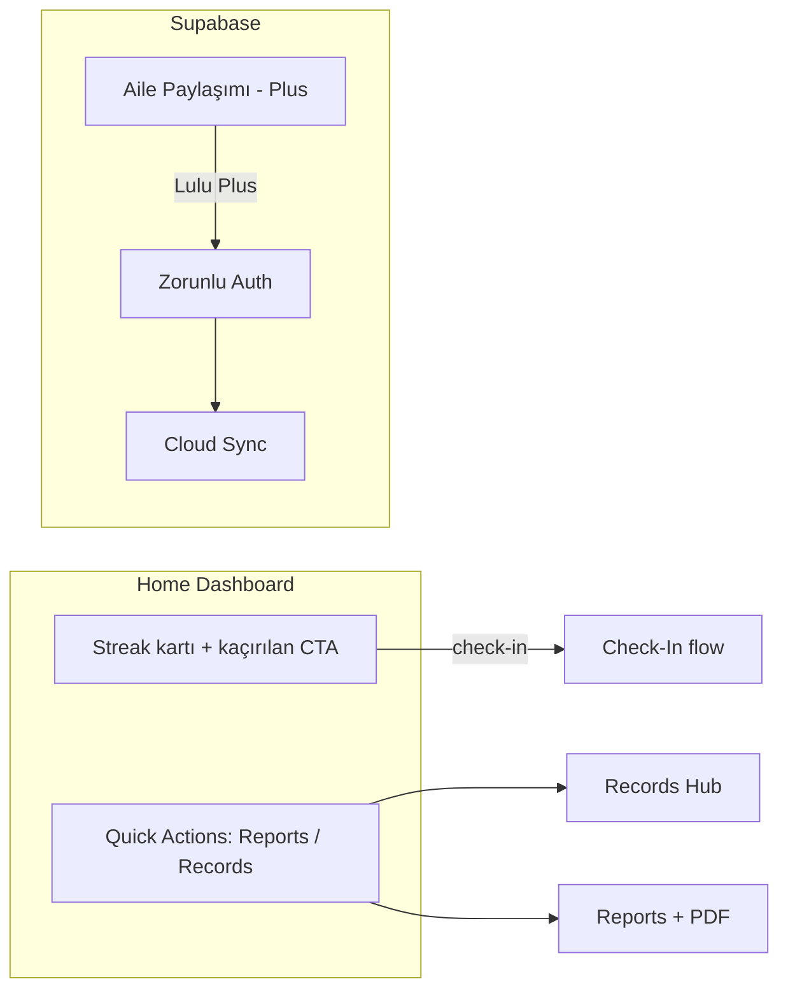

# Yapılacaklar

**Son güncelleme:** 2026-07-04 (Apple Sign In tamam; Google bekliyor)

Önceki task dosyalarının birleştirilmiş özeti. Tamamlanan işler arşivlendi; bu dosya yalnızca devam eden ve başlanmamış işleri içerir.

---

## Tamamlanan işler (özet)

Aşağıdaki büyük iş paketleri kod tarafında tamamlandı:

| Paket | Kapsam |
|-------|--------|
| Multi-Pet Migration | `activePetId`, My Pets, pet switch, delete all, store mimarisi, PRD/README |
| Settings HIG Redesign | Toggle + saat seçici, tema (Light/Dark/System), migration |
| Profile Tab Redesign | Hub ekranı, User Card, Lulu Plus / Community / Legal kartları, Settings ayrımı |
| Pet & Home HIG Redesign | Breed, günde 1 check-in, Home sadeleştirme, Pet Profile / Edit Pet |
| Daily Check-In Redesign | 6 kategorili snap carousel, i18n altyapısı, veri migration |
| Sprint 1–4 | Geri okları, System dili, TR/DE, streak kartı, Quick Actions, Records, Reports + PDF |
| Paket G | Pet ekleme / setup ekranları (ilk kurulum + add mode) |
| Paket I | Tek tema — Dark-first launch |
| Paket J | Dil kapsamı EN + DE (TR kaldırıldı) |
| Pet silme (B1+) | İsim onayı, tek/çoklu pet yönlendirme, iOS header fix |
| Apple Sign In | `signInWithApple` + Supabase `signInWithIdToken`; fiziksel cihazda test edildi |

---

## Kilitlemiş kararlar

| # | Konu | Karar |
|---|------|-------|
| K1 | "Check-In" terimi | Tüm dillerde ürün terimi olarak **"Check-In"** kalır |
| K2 | Dil seçimi (v1) | Yalnızca **EN + DE**; Settings'te **System / Automatic** (cihaz dili en/de dışındaysa EN fallback) |
| K19 | TR dili | **v1'de kaldırılacak** — TR pazarında yayın yok; ileride değerlendirilebilir |
| K20 | Tema (v1) | **Tek tema — Dark**; Light/Dark seçici Settings'ten kaldırılır veya gizlenir |
| K21 | Light mode | **Yayın sonrası** eklenecek (v1.1 veya sonrası) |
| K14 | Backend | **Supabase** |
| K15 | Guest modu | **Kaldırılacak** — tüm kullanıcılar auth zorunlu |
| K16 | Ücretsiz / ücretli | İki tier (Free + Lulu Plus); ikisi de auth gerektirir |
| K17 | Auth ekranı | **Zorunlu** — onboarding sonrası giriş şart |
| K18 | Aile paylaşımı | **Lulu Plus** aboneliği arkasında |

---

## Öncelik sırası

| Sıra | İş | Durum |
|------|-----|-------|
| 1 | TypeScript hataları (5 hata, 4 dosya) | ✅ Tamamlandı |
| 2 | QA — kalan manuel testler | 🔵 Devam ediyor |
| 3 | Auth — Supabase (email + cloud sync) | 🟢 email + pet/check-in/record/profil sync + Delete Account + **Apple Sign In** tamam |
| 3b | Google native giriş | ⬜ Başlanmadı (Apple ✅; bkz. bölüm 7) |
| 4 | Aile paylaşımı hazırlık (Lulu Plus) | ⬜ Başlanmadı |
| 5 | Free vs Plus rapor özellik farkları | ⬜ Başlanmadı (Auth sonrası) |
| 6 | PRD güncellemeleri (Profile hub, Screen 17) | ⬜ Başlanmadı |
| 7 | Auth ekranları geliştirme (Paket F) | ⬜ Başlanmadı |
| 8 | Pet ekleme ekranları geliştirme (Paket G) | ✅ Tamamlandı |
| 9 | Home boş durum & kullanıcı yönlendirme (Paket H) | ⬜ Başlanmadı |
| 10 | Tek tema — Dark-first launch (Paket I) | ✅ Tamamlandı |
| 11 | Dil: EN + DE, TR kaldır (Paket J) | ✅ Tamamlandı |
| 12 | Bildirim ekranları & mesajları (Paket K) | ⬜ Başlanmadı |

> **Not:** Paketler **A–E** önceki turda tanımlandı; **F–K** yayın öncesi UX/ürün kararları (2026-06-24). **F, H, K** Paket D (`design.md`) ile koordine edilmeli. **G, I, J** tamamlandı.

| Sıra | Yeni iş paketi | Durum |
|------|-----|-------|
| A | Eksik/placeholder özelliklerin tespiti & kararı | 🟢 A2 + A3 yapıldı; A1 bilinçli ertelendi |
| B | My Pets: pet silme + aktif/vefat eden ayrımı | ✅ B1 (silme) + B2 (status/anma) yapıldı |
| C | Records tasarım & listeleme güncellemeleri | 🟡 Grid + 8 kayıt türü yapıldı; listeleme/ekler bekliyor |
| D | Genel tasarım yenileme (`design.md`) | 🟡 `design.md` mevcut; uygulama başlanmadı |
| E | Beslenme/aktivite plan sistemi (günlük/haftalık) | ⬜ Başlanmadı (karar gerekli) |
| F | Auth ekranları (giriş & kayıt) geliştirme | ⬜ Başlanmadı |
| G | Pet ekleme ekranları geliştirme | ✅ Tamamlandı |
| H | Home boş durum & onboarding yönlendirme | ⬜ Başlanmadı |
| I | Tek tema (Dark-first; Light yayın sonrası) | ✅ Tamamlandı |
| J | Dil kapsamı: EN + DE (TR kaldır) | ✅ Tamamlandı |
| K | Bildirim ekranları & mesajları | ⬜ Başlanmadı |

---

## 🔵 Devam eden işler

### 1. TypeScript hataları ✅ Tamamlandı

`npx tsc --noEmit` → **0 hata** (temiz). Lint de temiz.

| # | Dosya | Çözüm |
|---|-------|-------|
| 1 | `app/(onboarding)/_layout.tsx`, `app/(setup)/_layout.tsx` | `detachInactiveScreens` kaldırıldı (v54'te geçersiz prop; form state `useSetupStore`'da tutuluyor) |
| 2 | `hooks/use-color-scheme.ts`, `hooks/use-color-scheme.web.ts` | `return systemScheme ?? null` |
| 3 | `services/notifications/schedule.ts` | `reminderTime` null guard eklendi |

---

### 2. QA — kalan manuel testler

#### Dil — Paket J ✅
- [ ] EN ↔ DE geçiş QA (tüm ekranlar) — kod tarafı tamam, manuel QA bekliyor
- [x] ~~EN ↔ TR~~ — TR v1'de kaldırıldı (Paket J)

#### Daily Check-In Redesign — Faz 5
- [ ] EN/DE dil geçişi
- [ ] Yeni kayıt + düzenleme
- [ ] Eski kayıt migration
- [ ] VoiceOver / Reduce Motion

#### Profile Tab — manuel test matrisi
- [ ] T1–T12: User Card, avatar, isim, Settings navigasyonu, Lulu Plus, Share, Instagram, Legal, Delete My Account, Dark mode, Dynamic Type
- [ ] Delete akışı 2 pet ile manuel test

#### Multi-Pet Migration — manuel test matrisi
- [ ] T1–T10: Fresh install, eski kullanıcı upgrade, 2. pet ekleme, pet switch, reminder metni, Delete All Data, dark mode vb.

---

## 🆕 Yeni iş paketleri (2026-06-22)

Bu beş paket, mevcut çekirdek tamamlandıktan sonra ele alınacak yeni kapsam. Detaylar netleştikçe genişletilecek; `is-plani.md` bunları sıraya ve bağımlılığa göre yerleştirecek.

---

### A. Eksik / placeholder özelliklerin tespiti & kararı

**Amaç:** "Butona basılıyor, çalışıyor gibi görünüyor ama aslında 'Çok Yakında' diyor" veya hiç bağlı olmayan yerleri tespit edip her biri için karar vermek (şimdi yap / bilinçli ertele / kaldır).

**Kod taraması sonucu bulunan placeholder/eksik noktalar:**

| # | Yer | Dosya | Mevcut davranış | Karar / Durum |
|---|-----|-------|-----------------|----------------|
| A1 | **Lulu Plus** Upgrade/Manage butonu | `components/profile/LuluPlusCard.tsx` | `ComingSoonModal` açılıyor; gerçek abonelik yok | ⏬ **Bilinçli ertele** — StoreKit/RevenueCat'e bağlı (Faz D + Gelecek). IAP gelene kadar coming-soon kalır |
| A2 | **Community → Rate Lulu** | `components/profile/CommunityCard.tsx` | ~~StoreReview yoksa/cooldown'da `ComingSoonModal`~~ | ✅ **Yapıldı** — yanıltıcı modal kaldırıldı; in-app prompt uygun değilse mağaza sayfası açılıyor (`APP_STORE_REVIEW_URL`, mağaza canlı olunca gerçek write-review linki ile değiştirilecek) |
| A3 | **Records → Attachments** (foto/dosya ekleme) | `app/records/[type].tsx` | ~~Karta basınca `ComingSoonModal`~~ | ✅ **Gizlendi** — placeholder kart + modal + `RecordAttachmentPlaceholder.tsx` kaldırıldı. Gerçek ek (foto/PDF → Supabase Storage) **Paket C** (Records yeniden tasarımı) kapsamına alındı |
| A4 | **Tek pet silme** (`deletePet`) | `stores/pet.store.ts` → çağıran UI yoktu | ~~Ölü kod~~ | ✅ **Bağlandı** — Paket B1 ile Edit Pet ekranına "Delete Pet" eklendi |

**Kalan:**
- [ ] A1: Lulu Plus IAP gerçeklenince coming-soon kaldırılacak (Faz D / Gelecek)
- [x] A2 metni düzeltildi · A3 gizlendi · A4 UI'a bağlandı
- [ ] Paket C'de: gerçek record ek yükleme (foto/PDF) tasarım + Supabase Storage

---

### B. My Pets — pet silme + aktif / vefat eden ayrımı

**Amaç:** My Pets sekmesine tek pet silme eklemek ve pet'leri "aktif" / "vefat eden" (anma) olarak gruplamak.

**B1 — Tek pet silme UI ✅ (Yapıldı + iyileştirildi)**
- [x] Konum kararı: **Edit Pet** ekranının altında kırmızı "Delete Pet" butonu (Apple Kişiler/Takvim pattern'i; keşfedilebilir, yanlışlıkla tetiklenmez)
- [x] Onay: pet ismi yazarak onay (`DeletePetConfirmModal`) + tüm ilgili verilerin silineceği uyarısı + i18n (en/de)
- [x] `usePetStore.deletePet`'e bağlandı (cloud + foto + local cascade)
- [x] Silme sonrası yönlendirme: tek pet → setup; çoklu pet → aktif pet home
- [x] Silme sırasında çökme / header buton genişleme fix'leri
- [ ] *(QA)* Son pet / aktif pet silme akışını cihazda doğrula (kullanıcı tekli/çoklu silmeyi onayladı)

**B2 — Aktif / vefat eden (memorial) ayrımı ✅ (Yapıldı)**
- [x] Veri modeli: `Pet`'e `status: 'active' | 'deceased'` (+ `deceasedAt`) — `types/pet.ts`, `storage/pet.storage.ts`, yerel migration v10 (`storage/database.ts`)
- [x] Supabase migration: `pets` tablosuna `status` / `deceased_at` kolonu (`0005_pet_status.sql`) + sync (`pets-sync.ts`)
- [x] My Pets ekranında iki bölüm: **Aktif** (`myPets.petsSection`) ve **Anma** (`myPets.memorialSection`) — basit ayrım; D ile cilalanacak
- [x] Vefat eden pet davranışı (kullanıcı kararı):
  - Reminder'lar otomatik iptal (`setPetStatus` → `cancelCheckInReminder` / aktif pet devri)
  - Aktif pet seçilemez / yeni check-in eklenemez (`getActivePet` aktif tercih + check-in salt-okunur)
  - Geçmiş check-in & records **salt-okunur** (Home memorial kartı, check-in & record form gating)
- [x] "Mark as deceased" + "Restore" aksiyonu (geri alınabilir) — **Edit Pet** ekranında, Delete'in üstünde + `ConfirmModal` + i18n (en/tr/de)

**Kalan (QA):**
- [ ] Tek pet'i vefat etti işaretleyip cihazda doğrula (reminder iptal, Home memorial, records salt-okunur, restore)
- [ ] Çok pet: aktif pet'i vefat etti işaretleyince aktif slotun başka canlı pet'e geçtiğini doğrula

---

### C. Records — tasarım & listeleme güncellemeleri

**Amaç:** Records ekranının tasarımsal ve listeleme açısından iyileştirilmesi.

> **Durum (2026-06-22):** Grid tasarımı ve kayıt türü genişletmesi tamamlandı. Son Kayıtlar listelemesi ve ekler sonraki iterasyonda.

**Yapıldı ✅**
- [x] **Kayıt Oluştur grid'i** — 4 sütunlu pastel ikon grid (`RecordTypeGrid` / `RecordTypeGridItem`); grid üstte, Son Kayıtlar altta
- [x] **8 kayıt türü** — Veteriner, Aşı, Parazit, İlaç, Semptom, Kilo, Operasyon, Test Sonuçları
- [x] **Semptom formu** — serbest metin + öneri chip'leri (Kusma, Halsizlik, …) + opsiyonel şiddet
- [x] **Operasyon formu** — işlem adı + opsiyonel klinik
- [x] **Test Sonuçları formu** — test adı + notlar
- [x] **Legacy migrasyon** — `vomiting` / `other` → `symptom` (yerel SQLite v11 + `0006_migrate_record_types.sql` + sync normalize)
- [x] i18n grid kısa etiketleri + form başlıkları (en/tr/de)
- [x] Commit: `90fd4d6` (grid), `e7bec09` (kayıt türleri)

**Kalan**
- [ ] **Son Kayıtlar** bölümü: gruplama (tür/tarih), filtre, arama, "tümünü gör" — sonraki iterasyon
- [ ] Yeni ikon seti (kullanıcıdan gelecek) — `constants/record-types.ts` içinde `icon` alanları güncellenecek
- [ ] A3 (attachments): gerçek foto/PDF ekleme → Supabase Storage (Paket C devamı)
- [ ] Paket D (genel tasarım) ile görsel uyum / cilalama

---

### D. Genel tasarım yenileme

**Amaç:** Uygulamanın genel görsel dilini yenilemek. Mevcut tasarım kullanıcıya yeterli gelmiyor.

> **Durum (2026-06-24):** `design.md` repo'da mevcut. Uygulama başlanmadı. **Paket I** ile koordine: v1'de yalnızca Dark token'ları aktif; Light token'ları kodda tutulabilir ama kullanıcıya kapalı.

- [ ] `design.md` analizi: hedef tasarım dili, renk paleti, tipografi, spacing, component stilleri
- [ ] `constants/theme.ts` + tema token'ları — **v1: Dark-only** (Paket I); Light yayın sonrası
- [ ] Ortak component'leri (Button, Card, ScreenContainer, list row'lar) yeni dile taşı
- [ ] Ekran ekran uygulama (Home, My Pets, Records, Reports, Profile, Settings, Check-In, Auth)
- [ ] Dynamic Type ile uyum doğrulama (tek tema Dark)
- [ ] C (Records), F (Auth), G (Setup), H (Home empty state) bu paketle koordine

---

### E. Beslenme / aktivite plan sistemi (günlük & haftalık)

**Amaç:** Seçili pet'e uygun günlük/haftalık beslenme ve/veya aktivite planı üreten bir sistem.

**Girdi (mevcut pet verisinden):** tür (cat/dog), yaş grubu, breed, sağlık koşulları, spay/neuter, (ops.) kilo/`weight` record'ları.

- [ ] Plan üretim yaklaşımı (karar gerekli): **kural tabanlı** (statik tablolar) mı, **AI/LLM** mı, hibrit mi?
- [ ] Plan kapsamı: yalnız beslenme mi, aktivite de mi? Günlük + haftalık görünüm
- [ ] Veri modeli: `types/plan.ts` (`FeedingPlan`, `ActivityPlan`, öğün/aktivite kalemleri)
- [ ] Üretim kaynağı & doğruluk: veteriner onaylı içerik mi, jenerik öneri mi? **Yasal uyarı (disclaimer) gerekli**
- [ ] UI konumu (karar gerekli): Home'da yeni kart / yeni tab / Pet Profile altında
- [ ] Tier kararı: **Free mi, Lulu Plus arkasında mı?**
- [ ] Plan ile Check-In/Records etkileşimi (örn. öğün tamamlandı işaretleme, hatırlatma)
- [ ] i18n (en/de) + içerik lokalizasyonu

**Açık sorular (re-plan öncesi netleşmeli):**
- Kural tabanlı mı AI mı?
- Free mi Plus mı?
- Sadece beslenme mi, aktivite dahil mi?
- İçerik kaynağı / sorumluluk (sağlık tavsiyesi hassas konu)

---

## 🆕 Yayın öncesi UX paketleri (2026-06-24)

Kullanıcı kararları: giriş/setup/home deneyimi, tek Dark tema, EN+DE dil kapsamı, bildirim metinleri. **Paket D (design.md) ile birlikte ele alınmalı** — F, H, K görsel dil D'den beslenir. **G, I, J tamamlandı.**

---

### F. Auth ekranları — giriş & kayıt geliştirme

**Amaç:** Mevcut email/şifre auth işlevsel; ekranlar yayın kalitesinde yeniden tasarlanacak.

**Kapsam:**
- [ ] `app/(auth)/index.tsx` — giriş / kayıt UI yenileme (`design.md` + Paket D)
- [ ] Form düzeni, hata durumları, loading state'leri
- [ ] Marka dili (başlık, alt metin, CTA hiyerarşisi)
- [ ] i18n: **en/de** (Paket J ✅ ile uyumlu)
- [x] Apple butonu bağlandı; Google bölüm 7'de bağlanacak
- [ ] Dynamic Type + erişilebilirlik (VoiceOver etiketleri)

**Bağımlılık:** Paket D (tasarım token'ları); Paket J (dil)

---

### G. Pet ekleme ekranları geliştirme ✅ Tamamlandı

**Amaç:** İlk kurulum (`(setup)`) ve "Add Pet" akışındaki ekranlar.

**Durum (2026-07-02):** Setup akışı (ilk kurulum + add mode) kullanıma hazır; kullanıcı onayı alındı.

**Kapsam:**
- [x] Setup akışı: `pet-type` → `pet-name-breed` → `pet-age-health` → `pet-photo` → check-in prefs / notification (+ add mode varyantı)
- [x] Add mode vs ilk kurulum farkları (add mode'da check-in prefs / notification atlanır)
- [x] i18n: **en/de**
- [ ] *(QA)* İlk pet + 2. pet ekleme akışları — manuel matriste
- [ ] Paket D sonrası görsel cilalama (opsiyonel)

**Bağımlılık:** ~~Paket D; Paket J~~ → J tamam; D cilalama isteğe bağlı

---

### H. Home — boş durum & kullanıcı yönlendirme

**Amaç:** Pet eklendikten sonra check-in, record vb. yapılmadığında Home boş kalıyor; kullanıcıyı uygulamayı öğretmek ve ilk aksiyona yönlendirmek.

**Sorun:** Yeni pet + henüz veri yok → dashboard anlamsız / boş görünüm.

**Kapsam (taslak):**
- [ ] Boş durum tespiti: pet var, check-in yok / streak 0 / records yok
- [ ] Onboarding-style yönlendirme kartı veya adım adım CTA'lar (örn. "İlk check-in'i yap", "Hatırlatıcıyı ayarla", "Kayıt ekle")
- [ ] İlk check-in tamamlandığında boş durumun kalkması
- [ ] Memorial (vefat) pet için ayrı boş/yönlendirme davranışı (salt-okunur)
- [ ] i18n: **en/de**
- [ ] `design.md` ile görsel uyum

**Bağımlılık:** Paket D

---

### I. Tek tema — Dark-first launch ✅ Tamamlandı

**Karar (K20, K21):** v1 yalnızca **Dark** tema; Light mode yayın sonrası.

**Durum (2026-07-02):** Uygulama Dark tema ile sorunsuz çalışıyor; kullanıcı onayı alındı.

**Kapsam:**
- [x] Settings'ten Light / Dark / System seçicisi kaldırıldı veya gizlendi
- [x] Uygulama genelinde tek Dark tema
- [x] Status bar, tab bar, modal, sheet'lerde Dark tutarlılığı
- [ ] Light mode token'ları — v1.1 için kodda tutulabilir (yayın sonrası)
- [ ] Paket D sonrası `constants/theme.ts` token cilalama (opsiyonel)
- [ ] *(QA)* Tüm ekranlarda Dark-only görsel kontrol — manuel matriste

**Not:** Paket D ile birlikte token cilalama yapılabilir; ayrı Light QA v1'de gerekmez.

---

### J. Dil kapsamı — EN + DE (TR kaldır) ✅ Tamamlandı

**Karar (K2 güncellendi, K19):** İlk yayın **EN ve DE**; TR pazarı yok.

**Durum (2026-07-02):** `i18n/en.ts` + `i18n/de.ts`; `tr.ts` yok; kullanıcı onayı alındı.

**Kapsam:**
- [x] `i18n/tr.ts` kaldırıldı; `i18n/index.ts` yalnızca `en` + `de`
- [x] Settings dil seçici: EN / DE / System (system → en veya de; diğerleri → EN fallback)
- [x] Kodda TR referansları temizlendi
- [ ] App Store / Play Store metadata: DE + EN pazarları (yayın öncesi)
- [ ] *(QA)* EN ↔ DE checklist — manuel matriste
- [ ] *(Gelecek)* TR yeniden eklenebilir — ayrı karar

**Bağımlılık:** F, G, H, K ile paralel — kod tarafı tamam

---

### K. Bildirim ekranları & mesajları

**Amaç:** Bildirim izni ekranı, hatırlatıcı ayarları ve push/local notification metinleri güncellenecek.

**Kapsam:**
- [ ] Onboarding / setup: `notification-permission` ekranı tasarım & metin
- [ ] Settings: hatırlatıcı saat seçimi UI/UX (`design.md`)
- [ ] Local notification metinleri (`services/notifications/`) — ton, kişiselleştirme (pet adı), **en/de**
- [ ] Pet reminder bildirimleri (`pet-reminder-schedule.ts`) metin gözden geçirme
- [ ] İzin reddedildi / kısıtlı durumda kullanıcı yönlendirmesi (Settings'e git)
- [ ] QA: farklı saat dilimleri, aktif pet değişimi, vefat pet reminder iptali

**Bağımlılık:** Paket D (ekranlar); ~~Paket J~~ (J ✅)

---

## ⬜ Başlanmamış işler

### 3. Auth — Supabase (Sprint 5, İş #9) — 🟡 email + pet sync tamam

**Mevcut durum:** Email/şifre + **Apple Sign In** uçtan uca çalışıyor; bootstrap auth guard aktif; pet/check-in/record/profil sync ve Delete Account tamam. Google native giriş bekliyor.

#### Faz A — Supabase kurulum ✅
- [x] `@supabase/supabase-js` + `expo-secure-store` (+ apple-auth, google-signin, dev-client, aes-js, url-polyfill, get-random-values)
- [x] Env config (`EXPO_PUBLIC_SUPABASE_URL`, `ANON_KEY`) + `lib/supabase.ts` (LargeSecureStore)
- [x] `app.json` (bundle id, usesAppleSignIn, plugin'ler) + `eas.json`
- [x] Supabase dashboard: Email ✅ + **Apple** ✅; Google provider kaldı

#### Faz B — Auth ekranı (zorunlu) ✅ (email + Apple)
- [x] `app/(auth)/index.tsx` — email/şifre giriş + kayıt (i18n en/de)
- [x] **"Continue as Guest" kaldırıldı**
- [x] Onboarding sonrası → `(auth)` (bootstrap guard)
- [x] Oturum yoksa hiçbir ana ekrana erişim yok
- [x] **Apple** butonu → `signInWithIdToken` (fiziksel iPhone dev build ile test edildi)
- [ ] **Google** butonu → bkz. bölüm 7

#### Faz C — User lifecycle 🟡
- [x] `user.store` — `signIn`, `signOut`, session dinleme
- [x] `currentUserId` ↔ Supabase `user.id`
- [x] Pet → `user_id` (Supabase user ID)
- [x] Log Out → auth ekranına dön
- [x] Hesap izolasyonu — farklı hesap girişinde yerel veri wipe
- [x] Delete Account → Supabase user silme (`delete_user` RPC, `0003_delete_user.sql`; cascade + avatar storage) + local wipe

#### Faz D — Free / Plus tier temeli ⬜
- [ ] `isPlusActive` — Supabase metadata veya RevenueCat (sonra)
- [ ] Tier'a göre özellik gating altyapısı

#### Faz E — Sync 🟡 (pet + check-in + record tamam)
- [x] Supabase şeması: `pets`/`check_ins`/`pet_records` + RLS + trigger (`supabase/migrations/0001_init.sql`)
- [x] **Pets**: kaynak-doğruluk sync (write-through + giriş/açılışta pull + yerel→bulut migrasyon)
- [x] **Check-ins**: write-through + pull + yerel→bulut migrasyon
- [x] **Records**: write-through + pull + yerel→bulut migrasyon
- [x] **Profil** (isim + avatar): `profiles` tablosu + `avatars` Storage bucket (`0002_profiles.sql`); cihazlar arası
- [x] Pet fotoğrafı → Supabase Storage (`pet-photos` bucket + RLS, `0004_pet_photos.sql`; `uploadPetPhoto`/`deletePetPhotoFiles`; edit-pet seçim anında yükler; pet/hesap silmede temizlik)
- [ ] *(İleri faz)* Offline-first kuyruk + last-write-wins çakışma çözümü

**Bootstrap akışı (uygulandı):**
```
Splash → Onboarding (ilk kez) → Auth (zorunlu) → Setup (pet yoksa) → Home
```

---

### 4. Aile paylaşımı hazırlık (Sprint 5, İş #10)

Auth + Supabase tamamlandıktan sonra. **Lulu Plus** aboneliği gerekli.

#### Faz A — Domain modeli
- [ ] `types/sharing.ts` — `CaregiverRole`, `PetInvite`, `SharedPet`
- [ ] Supabase tabloları: `pet_shares`, `invites`
- [ ] İzin matrisi: owner / editor / viewer

#### Faz B — Supabase RLS & API
- [ ] Row Level Security: pet erişimi role göre
- [ ] Davet akışı: email / deep link
- [ ] Çakışma: iki caregiver aynı gün check-in güncellerse?

#### Faz C — UI
- [ ] Pet Profile veya Settings → "Share with Family"
- [ ] `isPlusActive === false` → upgrade CTA (Lulu Plus)
- [ ] `isPlusActive === true` → davet gönder / caregiver listesi

#### Faz D — Store
- [ ] Aktif pet listesi: kendi pet'lerim + paylaşılanlar
- [ ] Paylaşılan pet'lerde rol bazlı UI (viewer = read-only)

---

### 5. Free vs Plus rapor özellik farkları (İş #7, Faz D)

Auth ve tier altyapısı hazır olduktan sonra:
- [ ] Free vs Plus rapor özellik farkları — şimdilik tümü açık veya basit gating

---

### 6. Dokümantasyon

- [ ] PRD Screen 17 güncelle — Profile hub + Settings ayrımı (Screen 17a / 17b)
- [ ] `docs: update PRD for profile hub and settings split` commit'i

---

### 7. Native sosyal giriş — Apple ✅ / Google ⬜

#### Apple Sign In ✅ (2026-07-04)
- [x] Apple Developer credential'ları (Team ID, Services ID, Key)
- [x] Supabase dashboard: Apple provider açık
- [x] `services/auth/signInWithApple` → `supabase.auth.signInWithIdToken`
- [x] `user.store` + auth ekranı butonu bağlandı
- [x] Fiziksel iPhone dev build ile test edildi (`expo run:ios --device`)

#### Google Sign In ⬜
- [ ] Google Cloud OAuth credential'ları
- [ ] Supabase dashboard: Google provider aç
- [ ] `EXPO_PUBLIC_GOOGLE_WEB_CLIENT_ID` + `EXPO_PUBLIC_GOOGLE_IOS_CLIENT_ID`
- [ ] `SocialAuthSection`: Google butonu → `signInWithIdToken`
- [ ] Fiziksel cihazda test (dev build)

---

## Gelecek (kapsam dışı, bağlantı noktaları)

| Konu | Bağımlılık |
|------|------------|
| StoreKit / RevenueCat | Lulu Plus gerçek IAP |
| Backend account deletion | Auth (Supabase) |
| My Pets'ten tek pet silme UI | ✅ Paket B1 |
| Pet başına notification prefs | v1 dışı |
| Cloud sync / cross-device active pet | Auth + Supabase |

---

## Ürün mimarisi (hedef)


