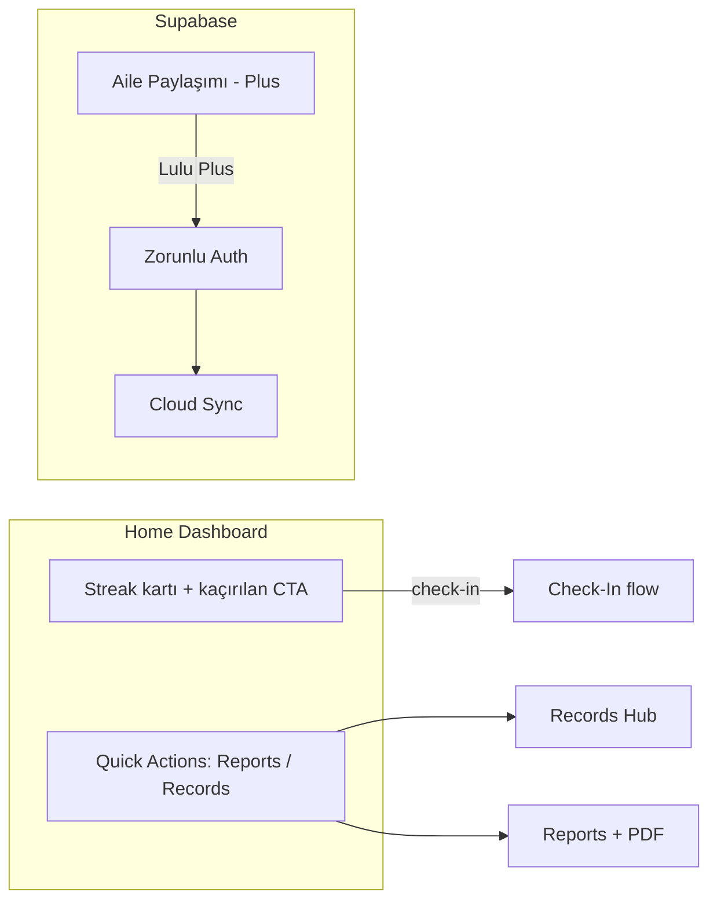

# Yapılacaklar

**Son güncelleme:** 2026-06-22

Önceki task dosyalarının birleştirilmiş özeti. Tamamlanan işler arşivlendi; bu dosya yalnızca devam eden ve başlanmamış işleri içerir.

---

## Tamamlanan işler (özet)

Aşağıdaki büyük iş paketleri kod tarafında tamamlandı:

| Paket | Kapsam |
|-------|--------|
| Multi-Pet Migration | `activePetId`, My Pets, pet switch, delete all, store mimarisi, PRD/README |
| Settings HIG Redesign | Toggle + saat seçici, tema (Light/Dark/System), migration |
| Profile Tab Redesign | Hub ekranı, User Card, Lulu Plus / Community / Legal kartları, Settings ayrımı |
| Pet & Home HIG Redesign | Breed, günde 1 check-in, Home sadeleştirme, Pet Profile / Edit Pet |
| Daily Check-In Redesign | 6 kategorili snap carousel, i18n altyapısı, veri migration |
| Sprint 1–4 | Geri okları, System dili, TR/DE, streak kartı, Quick Actions, Records, Reports + PDF |

---

## Kilitlemiş kararlar

| # | Konu | Karar |
|---|------|-------|
| K1 | "Check-In" terimi | Tüm dillerde ürün terimi olarak **"Check-In"** kalır |
| K2 | Dil seçimi | Settings'te **System / Automatic** seçeneği |
| K14 | Backend | **Supabase** |
| K15 | Guest modu | **Kaldırılacak** — tüm kullanıcılar auth zorunlu |
| K16 | Ücretsiz / ücretli | İki tier (Free + Lulu Plus); ikisi de auth gerektirir |
| K17 | Auth ekranı | **Zorunlu** — onboarding sonrası giriş şart |
| K18 | Aile paylaşımı | **Lulu Plus** aboneliği arkasında |

---

## Öncelik sırası

| Sıra | İş | Durum |
|------|-----|-------|
| 1 | TypeScript hataları (5 hata, 4 dosya) | ✅ Tamamlandı |
| 2 | QA — kalan manuel testler | 🔵 Devam ediyor |
| 3 | Auth — Supabase (email + cloud sync) | 🟢 email + pet/check-in/record/profil sync + Delete Account tamam (Apple/Google yayın öncesi) |
| 3b | Apple + Google native giriş | ⏬ Yayın öncesi son adıma ertelendi (bkz. bölüm 7) |
| 4 | Aile paylaşımı hazırlık (Lulu Plus) | ⬜ Başlanmadı |
| 5 | Free vs Plus rapor özellik farkları | ⬜ Başlanmadı (Auth sonrası) |
| 6 | PRD güncellemeleri (Profile hub, Screen 17) | ⬜ Başlanmadı |

---

## 🔵 Devam eden işler

### 1. TypeScript hataları ✅ Tamamlandı

`npx tsc --noEmit` → **0 hata** (temiz). Lint de temiz.

| # | Dosya | Çözüm |
|---|-------|-------|
| 1 | `app/(onboarding)/_layout.tsx`, `app/(setup)/_layout.tsx` | `detachInactiveScreens` kaldırıldı (v54'te geçersiz prop; form state `useSetupStore`'da tutuluyor) |
| 2 | `hooks/use-color-scheme.ts`, `hooks/use-color-scheme.web.ts` | `return systemScheme ?? null` |
| 3 | `services/notifications/schedule.ts` | `reminderTime` null guard eklendi |

---

### 2. QA — kalan manuel testler

#### Türkçe dil (İş #1)
- [ ] EN ↔ TR geçiş QA (tüm ekranlar)

#### Daily Check-In Redesign — Faz 5
- [ ] EN/TR dil geçişi
- [ ] Yeni kayıt + düzenleme
- [ ] Eski kayıt migration
- [ ] VoiceOver / Reduce Motion

#### Profile Tab — manuel test matrisi
- [ ] T1–T12: User Card, avatar, isim, Settings navigasyonu, Lulu Plus, Share, Instagram, Legal, Delete My Account, Dark mode, Dynamic Type
- [ ] Delete akışı 2 pet ile manuel test

#### Multi-Pet Migration — manuel test matrisi
- [ ] T1–T10: Fresh install, eski kullanıcı upgrade, 2. pet ekleme, pet switch, reminder metni, Delete All Data, dark mode vb.

---

## ⬜ Başlanmamış işler

### 3. Auth — Supabase (Sprint 5, İş #9) — 🟡 email + pet sync tamam

**Mevcut durum:** Email/şifre auth uçtan uca çalışıyor; bootstrap auth guard aktif; pet/check-in/record/profil sync ve Delete Account tamam. Apple/Google yayın öncesine ertelendi.

#### Faz A — Supabase kurulum ✅
- [x] `@supabase/supabase-js` + `expo-secure-store` (+ apple-auth, google-signin, dev-client, aes-js, url-polyfill, get-random-values)
- [x] Env config (`EXPO_PUBLIC_SUPABASE_URL`, `ANON_KEY`) + `lib/supabase.ts` (LargeSecureStore)
- [x] `app.json` (bundle id, usesAppleSignIn, plugin'ler) + `eas.json`
- [ ] Supabase dashboard: Email açık ✅; Apple/Google provider'lar kaldı

#### Faz B — Auth ekranı (zorunlu) ✅ (email)
- [x] `app/(auth)/index.tsx` — email/şifre giriş + kayıt (i18n en/tr/de)
- [x] **"Continue as Guest" kaldırıldı**
- [x] Onboarding sonrası → `(auth)` (bootstrap guard)
- [x] Oturum yoksa hiçbir ana ekrana erişim yok
- ⏬ Apple / Google butonları → **yayın öncesi son adıma ertelendi** (bkz. bölüm 7)

#### Faz C — User lifecycle 🟡
- [x] `user.store` — `signIn`, `signOut`, session dinleme
- [x] `currentUserId` ↔ Supabase `user.id`
- [x] Pet → `user_id` (Supabase user ID)
- [x] Log Out → auth ekranına dön
- [x] Hesap izolasyonu — farklı hesap girişinde yerel veri wipe
- [x] Delete Account → Supabase user silme (`delete_user` RPC, `0003_delete_user.sql`; cascade + avatar storage) + local wipe

#### Faz D — Free / Plus tier temeli ⬜
- [ ] `isPlusActive` — Supabase metadata veya RevenueCat (sonra)
- [ ] Tier'a göre özellik gating altyapısı

#### Faz E — Sync 🟡 (pet + check-in + record tamam)
- [x] Supabase şeması: `pets`/`check_ins`/`pet_records` + RLS + trigger (`supabase/migrations/0001_init.sql`)
- [x] **Pets**: kaynak-doğruluk sync (write-through + giriş/açılışta pull + yerel→bulut migrasyon)
- [x] **Check-ins**: write-through + pull + yerel→bulut migrasyon
- [x] **Records**: write-through + pull + yerel→bulut migrasyon
- [x] **Profil** (isim + avatar): `profiles` tablosu + `avatars` Storage bucket (`0002_profiles.sql`); cihazlar arası
- [ ] Pet fotoğrafı → Supabase Storage (avatar altyapısı hazır, aynı desen)
- [ ] *(İleri faz)* Offline-first kuyruk + last-write-wins çakışma çözümü

**Bootstrap akışı (uygulandı):**
```
Splash → Onboarding (ilk kez) → Auth (zorunlu) → Setup (pet yoksa) → Home
```

---

### 4. Aile paylaşımı hazırlık (Sprint 5, İş #10)

Auth + Supabase tamamlandıktan sonra. **Lulu Plus** aboneliği gerekli.

#### Faz A — Domain modeli
- [ ] `types/sharing.ts` — `CaregiverRole`, `PetInvite`, `SharedPet`
- [ ] Supabase tabloları: `pet_shares`, `invites`
- [ ] İzin matrisi: owner / editor / viewer

#### Faz B — Supabase RLS & API
- [ ] Row Level Security: pet erişimi role göre
- [ ] Davet akışı: email / deep link
- [ ] Çakışma: iki caregiver aynı gün check-in güncellerse?

#### Faz C — UI
- [ ] Pet Profile veya Settings → "Share with Family"
- [ ] `isPlusActive === false` → upgrade CTA (Lulu Plus)
- [ ] `isPlusActive === true` → davet gönder / caregiver listesi

#### Faz D — Store
- [ ] Aktif pet listesi: kendi pet'lerim + paylaşılanlar
- [ ] Paylaşılan pet'lerde rol bazlı UI (viewer = read-only)

---

### 5. Free vs Plus rapor özellik farkları (İş #7, Faz D)

Auth ve tier altyapısı hazır olduktan sonra:
- [ ] Free vs Plus rapor özellik farkları — şimdilik tümü açık veya basit gating

---

### 6. Dokümantasyon

- [ ] PRD Screen 17 güncelle — Profile hub + Settings ayrımı (Screen 17a / 17b)
- [ ] `docs: update PRD for profile hub and settings split` commit'i

---

### 7. Yayın öncesi son adım — Apple + Google native giriş ⏬

**Karar:** Tüm özellikler bittikten sonra, yayına çıkmadan hemen önce eklenecek. Email/şifre auth geliştirme boyunca yeterli. Native Apple/Google testi development build + credential gerektirdiği için en sona bırakıldı.

- [ ] Apple Developer + Google Cloud OAuth credential'ları
- [ ] Supabase dashboard: Apple + Google provider'ları aç
- [ ] `EXPO_PUBLIC_GOOGLE_WEB_CLIENT_ID` + `EXPO_PUBLIC_GOOGLE_IOS_CLIENT_ID`
- [ ] `app/(auth)/index.tsx`: Apple + Google butonları → `signInWithIdToken`
- [ ] EAS development build ile native test (Expo Go yetmez)

---

## Gelecek (kapsam dışı, bağlantı noktaları)

| Konu | Bağımlılık |
|------|------------|
| StoreKit / RevenueCat | Lulu Plus gerçek IAP |
| Backend account deletion | Auth (Supabase) |
| My Pets'ten tek pet silme UI | v1 dışı |
| Pet başına notification prefs | v1 dışı |
| Cloud sync / cross-device active pet | Auth + Supabase |

---

## Ürün mimarisi (hedef)


